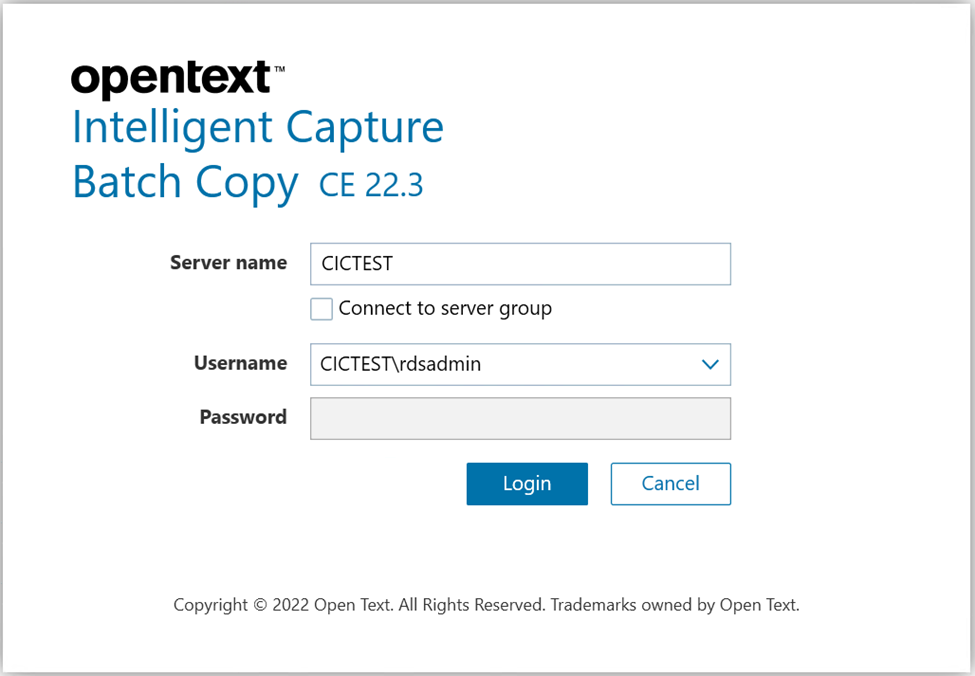
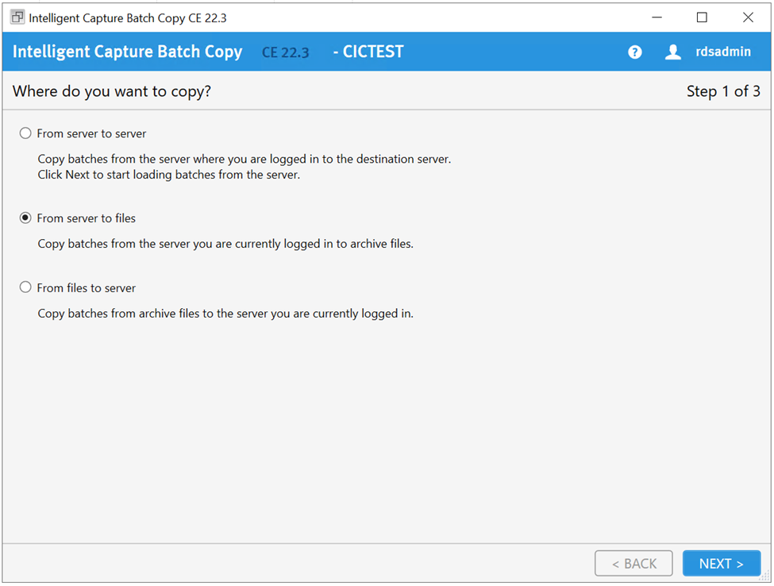
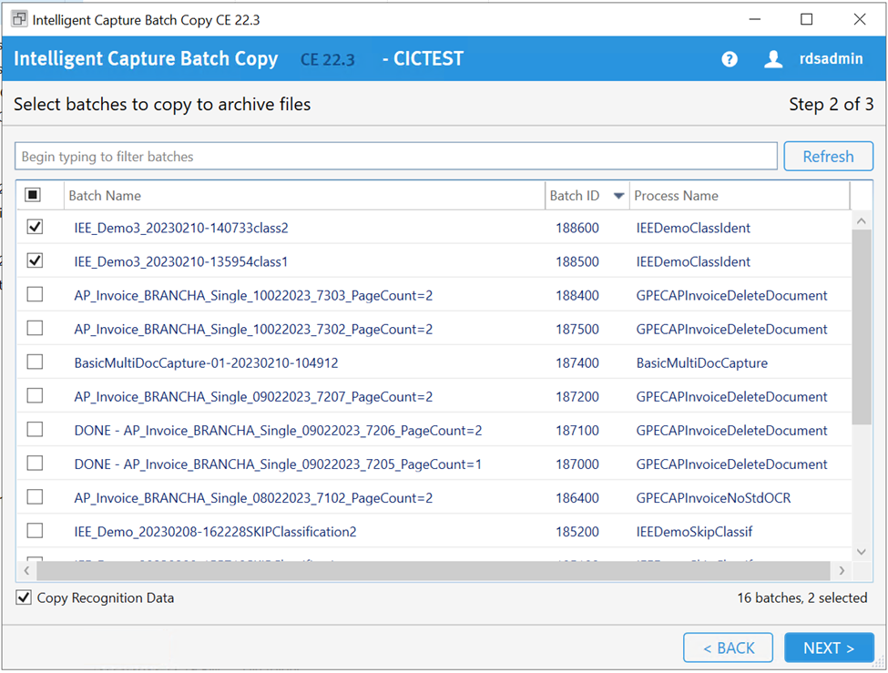
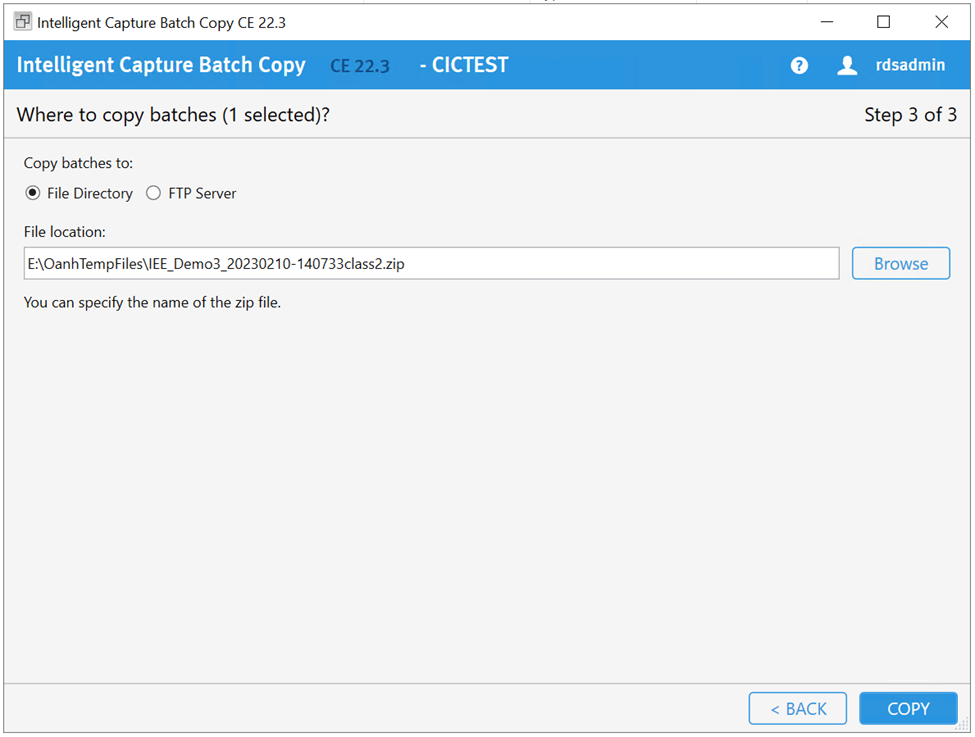
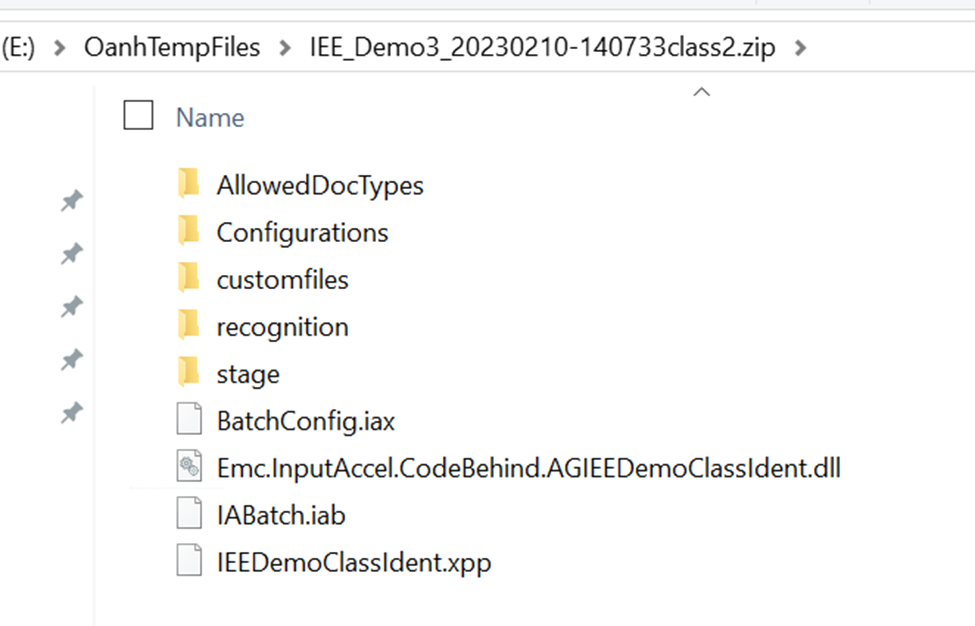

# OpenText Intelligent Capture: How to Copy Batches to a Directory Using Batch Copy CE 22.3

The **Batch Copy CE 22.3** utility can be used to copy batches from the Intelligent Capture server to a folder.

---

## Steps

### 1. Launch Batch Copy CE 22.3

In the Windows search tool, type **"BatchCopy"**, or navigate to the following path and launch `BatchCopy.exe`:

```
C:\Program Files (x86)\InputAccel\Client\binnt
```

Log in with your **Server name**, **Username**, and **Password**, then click **Login**.



---

### 2. Select "From Server to Files"

On the main screen, choose the **From server to files** option to begin the export process.



---

### 3. Select the Batch(es) to Copy

- Choose the batch(es) you wish to copy from the list.
- Check **Copy Recognition Data** to include the Advanced Recognition or Information Extraction project.
- Click **Next**.



---

### 4. Select Destination and Copy

- Select **File Directory** as the destination type.
- Browse to or type in the target file location. If copying a single batch, you may specify the zip file name directly.
- Click **Copy**.



---

### 5. Verify the Output

The resulting zip file will contain all files associated with the copied batch, including any recognition data if that option was selected.


