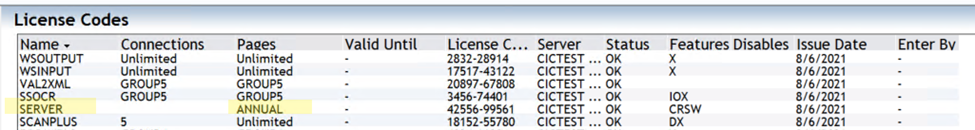
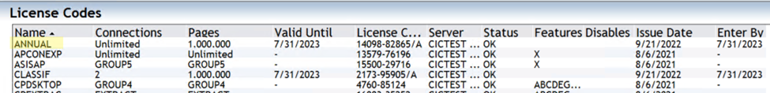
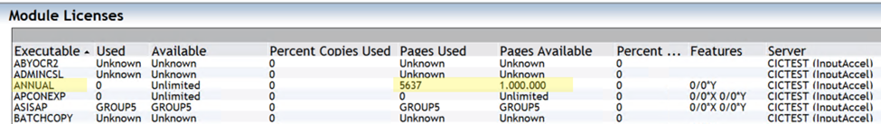
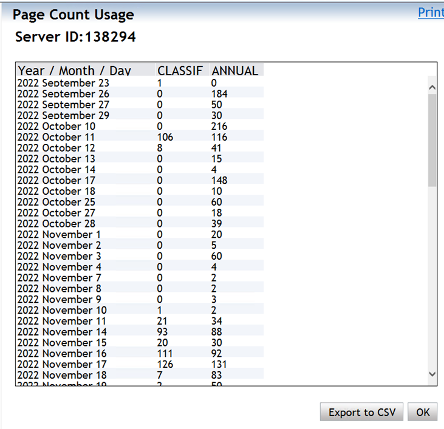

# OpenText Intelligent Capture: How to Check Your Server or Annual Page Count Usage

## Why This Matters

If you've ever had processing suddenly stop mid-batch and wondered why, there's a good chance your page count license ran out. Intelligent Capture licensing is based on **page counts** and **connections** for client modules and the server - and unlike most system errors, a depleted page count doesn't always throw an obvious warning. You just stop processing.

This article walks you through the three places in Intelligent Capture Administrator where you can check your license health, see how many pages you have left, and monitor your daily usage trends. It takes about five minutes and is worth doing regularly.

---

## Understanding the License Structure First

Before jumping into the screens, it helps to understand how Captiva's page count licensing is structured:

- **SERVER** license - this is the top-level license entry. If you look at it in the License Codes screen, you'll notice its *Pages* column doesn't show a number - it shows **"ANNUAL"**. That's intentional. It means the SERVER license delegates its page count to one or more ANNUAL sub-licenses.
- **ANNUAL** license(s) - these are where the actual page count lives. Each ANNUAL license has a specific number of pages (e.g. 1,000,000) and an expiry date. Your effective SERVER page count is the **sum of all ANNUAL licenses that have "OK" status**.

> **Key rule:** If an ANNUAL license expires or gets disabled, its pages are removed from your total - even if the SERVER license itself still shows as valid.

---

## Step 1 - Check Your License Codes

**Where to go:** Administrator → Licensing/Security → View License Codes

This is your first stop. Think of this as a health check for your licenses.

Once you're on the License Codes page, look for the **SERVER** row. As shown below, the Pages column will say **"ANNUAL"** - confirming the SERVER is drawing its page count from ANNUAL licenses.

*The SERVER license row with Pages showing "ANNUAL" - this is normal and expected.*

Next, scroll or filter to find the **ANNUAL** license row(s). Here's what to check:

| Column | What to look for | Example from the system |
|---|---|---|
| **Pages** | Your total licensed page count | 1,000,000 |
| **Valid Until** | Expiry date - flag if within 60 days | 7/31/2023 |
| **Status** | Must be **OK** to count toward your total | OK |

*The ANNUAL license showing 1,000,000 pages with a Valid Until date of 7/31/2023 and Status = OK.*

A couple of things to watch out for here:

- If you have **multiple ANNUAL licenses**, add up the pages from all rows that show **"OK"** in the Status column. That total is your actual available page count.
- **Do not include** ANNUAL licenses with any other status - disabled or expired licenses do not contribute to your page count, even if they appear in the list.
- If the **Valid Until** date is approaching, start the renewal process early. Once it expires, those pages drop off immediately.

---

## Step 2 - Check Module Licenses (Pages Used vs. Available)

**Where to go:** Administrator → Licensing/Security → View Module Licenses

Once you've confirmed your licenses look healthy, head to the Module Licenses page to see your actual consumption in real time.

Find the **ANNUAL** row in the module list. The two columns you care about are:

- **Pages Used** - how many pages have been processed against this license so far.
- **Pages Available** - how many pages remain before you hit the limit.

*The ANNUAL module license showing Pages Used = 5,637 and Pages Available = 1,000,000.*

In the example above, 5,637 pages have been consumed out of a 1,000,000 page entitlement - so there's plenty of runway left. If your Pages Available number is getting low (say, under 10% of your total), that's the signal to contact your OpenText account team to top up or renew.

> **Quick sanity check:** Pages Used + Pages Available should roughly equal your licensed total from Step 1. If the numbers don't add up, go back and verify all your ANNUAL licenses are in "OK" status.

---

## Step 3 - View the Page Count Usage Report

**Where to go:** Administrator → Licensing/Security → View Page Count Report

This is the screen most people skip - and it's honestly the most useful one for planning. The Page Count Usage report gives you a day-by-day breakdown of how pages are being consumed, broken out by license type.

To generate it:
1. Select your **server** from the server list (the report is per server).
2. Click the **View Usage** button.

*Daily page count breakdown showing CLASSIF and ANNUAL columns side by side.*

The report shows columns for each license type - in the example above, **CLASSIF** (Classification) and **ANNUAL**. Each row is a date, and you can see exactly how many pages each license type consumed on that day.

A few things this report can tell you:

- **Are there processing spikes?** If you see a spike on a particular date, you can correlate it with what batches were running that day.
- **Is consumption trending upward?** Consistent month-over-month growth means you should plan your next license renewal with a larger page count.
- **Is the CLASSIF count much higher than ANNUAL (or vice versa)?** This can hint at classification-heavy workloads that might need configuration tuning.

You can also click **Export to CSV** to pull the data into Excel for longer-term trend analysis - highly recommended if you're doing quarterly license planning.

---

## Quick Reference Summary

| Step | Navigation | What You're Checking |
|---|---|---|
| **1 - License Codes** | Admin → Licensing/Security → View License Codes | SERVER shows "ANNUAL" for pages; ANNUAL license has OK status and valid expiry |
| **2 - Module Licenses** | Admin → Licensing/Security → View Module Licenses | Pages Used vs. Pages Available for ANNUAL |
| **3 - Page Count Report** | Admin → Licensing/Security → View Page Count Report | Daily consumption trends by license type |

---

## Things to Keep in Mind

- The SERVER page count = **total pages across all ANNUAL licenses with "OK" status only**.
- An expired or disabled ANNUAL license **immediately reduces** your available count - no grace period.
- Always check **both** the Valid Until date and the Status column. A license can show a future date but still have a non-OK status if it was manually disabled.
- The Page Count Usage report has an **Export to CSV** button - use it. It makes license renewal conversations with OpenText much easier when you have historical data to back up your ask.
- If you're unsure whether your page count is about to run out, check Step 2 first - it's the fastest read.

---

*If your license is expiring soon or Pages Available is critically low, contact your OpenText account representative or raise a case through OpenText My Support.*