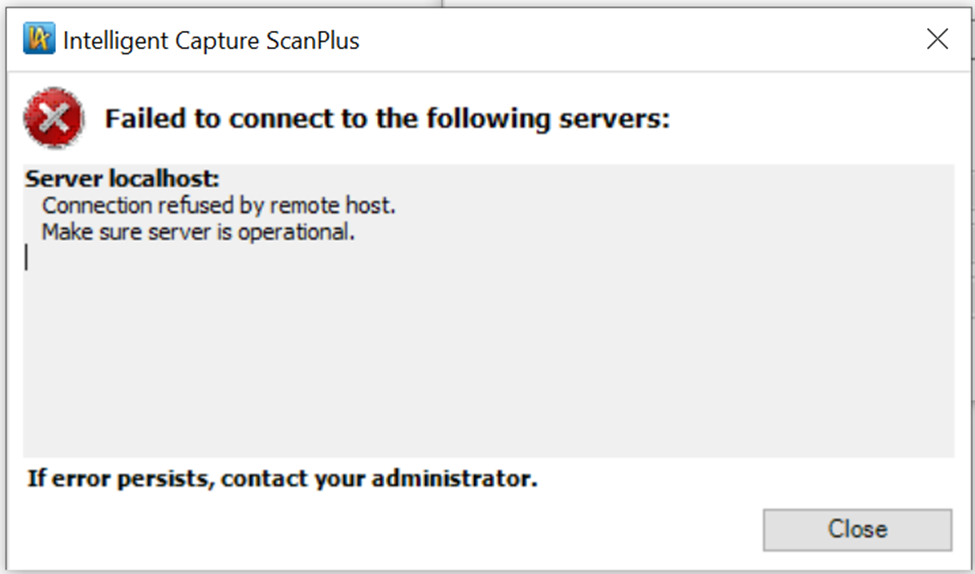

```markdown
# OpenText Intelligent Capture: "Connection Refused by Remote Host. Make Sure Server 
Is Operational" Error When Logging Into the Server

---

## The Issue

When trying to log into **Scanplus**, you run into this error:

> *"Connection refused by remote host. Make sure server is operational"*



---

## What's Causing This

This one usually comes down to one of two things — either the **Intelligent Capture 
service isn't running** on the server, or your machine simply **can't reach the server** 
at all. The good news is both are straightforward to check.

---

## How to Fix It

Work through the steps below in order — most of the time you'll find the culprit early on.

---

### Step 1: Check That the Intelligent Capture Service Is Running

Head over to the server and verify that the **Intelligent Capture / InputAccel Server** 
service is actually up and running. If it's stopped or in a failed state, starting it 
back up will likely resolve the issue immediately.

- Open **Windows Services** (`services.msc`)
- Look for the **Intelligent Capture** or **InputAccel Server** service
- Confirm its status is **Running** — if not, right-click and select **Start**


---

### Step 2: Test Basic Connectivity With Ping

If the service is running but you're still getting the error, let's make sure your 
machine can actually reach the server. Open a **Command Prompt** and run a `ping` 
using the server's machine name, FQDN, or IP address:

```
ping ServerABC
ping ServerABC.domain.com
ping 192.168.1.100
```

This will help you quickly spot any **connectivity or name resolution** issues between 
your machine and the server.


---

### Step 3: Check Port 10099

Even if ping succeeds, the connection might still be blocked on the specific port that 
Intelligent Capture uses. Open **PowerShell** and run the `tnc` command to test 
connectivity through **port 10099**:

```powershell
tnc ServerABC -port 10099
```

If the result comes back as `TcpTestSucceeded : False`, you've got a port connectivity 
issue — likely a firewall rule blocking the connection. You'll want to work with your 
network or infrastructure team to get port **10099** opened between your client and 
the server.


---

> **Quick recap:** Start by confirming the service is running, then verify you can reach 
> the server over the network, and finally confirm port 10099 is accessible. Work through 
> these three checks and you should have your answer quickly.
```