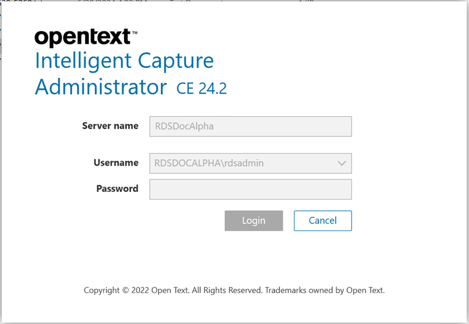
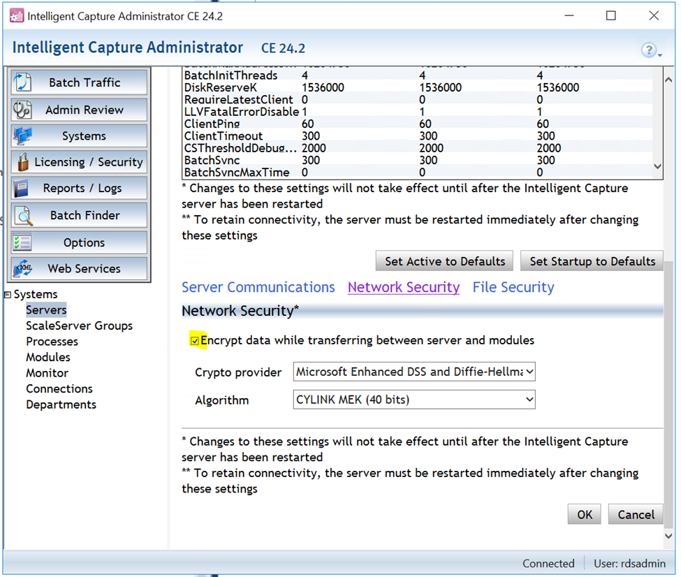
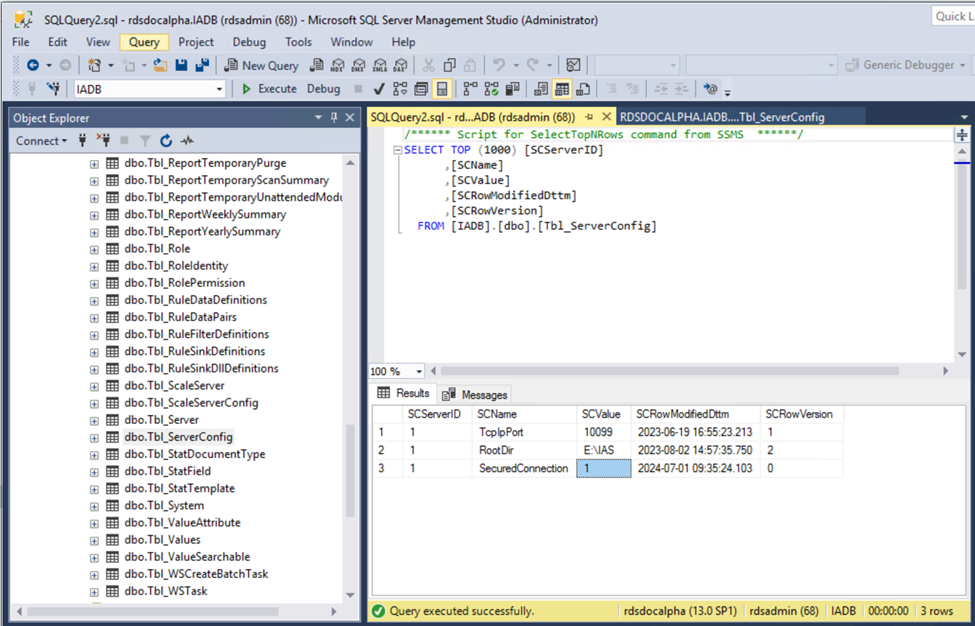

# OpenText Intelligent Capture: Can't Log In to Administrator After Enabling Network Data Encryption

---

## The Issue

If you've recently enabled the **network data encryption** feature and now find yourself 
unable to log in to Administrator — you're not alone. The login screen may freeze or hang 
indefinitely after clicking **Login**, leaving you stuck with no obvious way forward.

---

## What's Causing This

Here's the frustrating part — this is actually a **known bug** with the network data 
encryption feature. It was first reported in **IC 22.3** and may still show up in later 
versions, so don't spend too much time troubleshooting your environment. It's not you, 
it's the feature itself.

---

## How to Fix It

You have two paths forward depending on whether you can still access Administrator or not.

---

### Option 1: You Can Still Access Administrator

If you're able to get in, simply **disable the network data encryption feature** to revert 
the setting that's causing the problem.

---

### Option 2: You're Completely Locked Out

If the login screen is hanging and you can't get into Administrator at all, you'll need to 
go directly to the **database** and make the following change manually:

- Locate the **`SCValue`** field in the database
- Set it to **`0`**

This will effectively disable the encryption setting at the database level, allowing you 
to log back in normally.

---

> **Bottom line:** Avoid using the network data encryption feature in IC 22.3 and later 
> versions until a fix is officially released. If you're already locked out, the database 
> fix above will get you back in quickly.