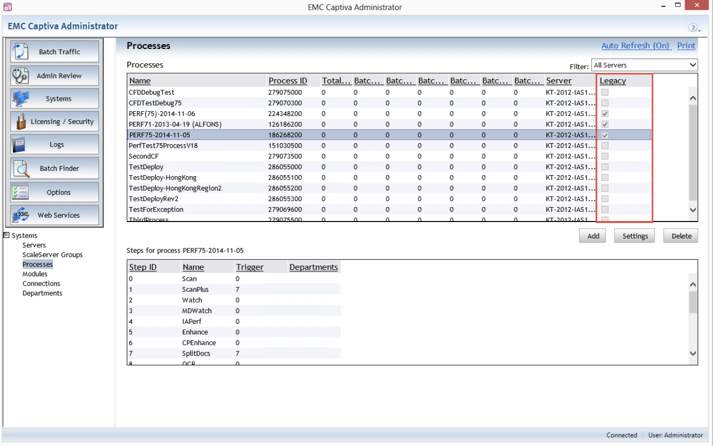
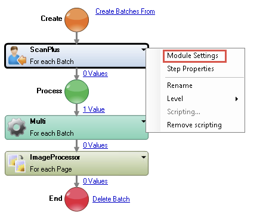

# Captiva Capture Architecture and Deployment in 7.5

## Part One: Core Architecture

Captiva Capture is built around a server-centric architecture where a central server coordinates
all document capture activity by routing work to a set of client modules. Understanding this model
is essential for designing, deploying, and troubleshooting any Captiva environment.

### The Server and Its Role

The core of the system is the InputAccel Server (also called the Captiva Capture server). The
server does not perform capture work itself. Its job is to manage and coordinate: it tracks batches,
forms tasks, and routes those tasks to available client modules based on the instructions in the
active CaptureFlow.

The server stores all batch data, IA values, and stage files. It handles task scheduling,
priority queuing, and task locking to prevent concurrent module access to the same node.

### Production Modules

Production modules run on client machines and perform the actual processing: scanning,
image enhancement, OCR, indexing, classification, and export. The server pushes tasks to modules
as they become available using a push-based model that minimizes idle time.

Most modules run as unattended Windows services. Attended modules like ScanPlus and
Completion require operator interaction. Communication happens over TCP/IP, or SOAP for
remote systems. Third-party modules can integrate provided they follow the Module Definition
File (MDF) specification.

### Asynchronous Task Processing

Tasks are self-contained. A module processes a task and immediately picks up the next one.
The server routes completed tasks forward to the next CaptureFlow step. This asynchronous model
allows modules from different batches to run in parallel without blocking each other.

If no module is available, tasks queue until one becomes free.

### Batch Structure

All data flows through batches, organized as trees with up to eight levels. Pages sit at level 0,
the batch at level 7. Intermediate levels group pages into documents or folders based on the
process design.

This structure lets modules process data at the appropriate level. Image enhancement works page
by page. Export works at the batch level.

### Horizontal Scaling: ScaleServer Groups

When a single InputAccel Server is insufficient, multiple servers form a ScaleServer group.
All servers share a single external SQL Server database. Each server manages task scheduling
independently. Each batch lives on exactly one server at a time.

ScaleServer is the primary horizontal scaling mechanism.

### REST Services Layer

Captiva 7.5 introduced REST Services, a web-tier component exposing capture functionality as
REST endpoints. It sits between clients (browsers, mobile apps) and the application tier, providing
document classification, data extraction, barcode recognition, OCR, image processing, and validation.
REST Services scales horizontally across multiple web servers sharing a common data folder.

---

## Part Two: Deployment Architecture in 7.5

The shift from Administrator to Designer as the primary deployment tool marks a fundamental
change in how processes move from development to production. This is not just a UI reorganization.
It reflects an architectural shift from administrator-centric to developer-centric process management.

### The Dual-Path Deployment Model

Captiva 7.5 introduces a critical distinction: processes are classified as either **legacy** or
**CodeBehind-enabled**. This classification determines which deployment operations are available.

In earlier versions, all processes were monolithic IPP files. Captiva Administrator could manipulate
them through: copy, delete, rename, upgrade.

CaptureFlows change this. A CaptureFlow compiles to an IAP file (binary), but supporting artifacts
(CodeBehind DLLs and autogen DLLs) exist as separate files in the process's SystemFiles directory.
This decoupling creates a consistency problem: deleting the IAP while leaving DLLs behind creates
an inconsistent state.

The solution: restrict administrator operations on CodeBehind processes and require Captiva Designer,
where deployment logic understands the full artifact graph.


# Deployment Architecture in Captiva 7.5: Designer vs. Administrator

## Introduction

The shift from Captiva Administrator as the primary deployment tool to Captiva Designer marks a fundamental change in how capture processes move from development to production. Understanding this transition isn't just about learning new UI workflows-it's about grasping the architectural rationale behind why certain operations are now restricted, why others have been completely reimplemented, and how the platform's treatment of legacy processes creates a dual-path deployment model that must be navigated carefully.

This article examines the deployment behavior changes introduced in Captiva 7.5, focusing on the technical constraints that emerge when CodeBehind processes encounter the legacy deployment feature set.

---

## The Dual-Path Deployment Model

Captiva 7.5 introduces a critical distinction: processes are now classified as either **legacy** or **CodeBehind-enabled**. This classification determines which deployment operations are available and, more importantly, which ones will fail silently or with cryptic error messages.

### Why This Distinction Exists

In earlier versions, all processes were monolithic IPP files compiled as opaque binaries. Captiva Administrator could manipulate these binaries through well-defined administrator operations: copy, delete, rename, upgrade.

CaptureFlows change this equation. A CaptureFlow compiles to an IAP file (still binary), but the supporting artifacts-CodeBehind script DLLs and autogen DLLs-exist as separate files in the process's SystemFiles directory. This decoupling creates a problem that legacy processes don't face: if you delete the IAP but leave the DLLs behind, or if you rename the IAP without updating the DLL references, the system becomes inconsistent.

The solution: restrict administrator operations on CodeBehind processes and require developers to use Captiva Designer instead, where deployment logic understands the full artifact graph and can maintain consistency automatically.
---

## The Legacy Process Column

The foundation of feature gating is a hidden column in Captiva Administrator labeled **"Legacy"**.
This boolean flag indicates whether a process uses CodeBehind:

- **Legacy flag checked**: Traditional IPP architecture. All legacy deployment features available.
- **Legacy flag unchecked**: CodeBehind-enabled (CaptureFlow). Legacy features disabled.

The column is hidden by default but can be surfaced through the **Column Manager** dialog.


*Figure 1: The Column Manager displays available columns. The "Legacy" column (highlighted) indicates process type: checked for legacy, unchecked for CodeBehind.*



---

## Feature Availability Matrix

The legacy/CodeBehind distinction has precise, deterministic impact:

| Operation | Legacy Process | CodeBehind Process | Why |
|---|---|---|---|
| **Add Upgraded Process** | ✓ Available | ✗ N/A | Designer handles versioning |
| **Add Process** | ✓ Available | ✗ Error | Cannot deploy CodeBehind DLLs |
| **Delete Process** | ✓ Always | ✓ If no batches | DLL decoupling requires batch safety |
| **Rename Process** | ✓ Available | ✗ Read-only | CodeBehind depends on process name |
| **Copy Process** | ✓ Available | ✗ N/A | Designer handles multi-server |
| **Copy/Paste Settings** | ✓ Full | ✓ Single value | Proactive sync replaces copy/paste |

---

## The Core Deployment Operations

### Add Upgraded Process

**Availability:** Legacy processes only

This delete-and-replace mechanism allows updating a process. When invoked, you select a newer
IAP or IPP file, and the administrator:

1. Backs up the existing process (optional)
2. Backs up metadata (optional)
3. Removes the old IAP and associated files
4. Deploys the new file
5. Applies to selected servers in a ScaleServer group


*Figure 2: The Upgrade Process dialog. Users select a replacement IAP or IPP file, optionally back up, and select target servers.*

For CodeBehind processes, this is unavailable. Captiva Designer handles upgrades natively. When
you deploy a CaptureFlow in Designer, it detects the current version, removes old artifacts (IAP,
CodeBehind DLL, autogen DLL), and deploys new ones. Designer's awareness of the full dependency
graph prevents orphaned files.

### Add Process

**Availability:** Legacy processes only

This deploys a single IAP or IPP to specified servers. The dialog collects:
- Process name
- Path to IAP/IPP file
- Priority for new batches
- Target servers
- Optional description


*Figure 3: The Install Process dialog. For legacy processes, it deploys the file and registers it. For CodeBehind, it fails with: "The process was compiled in CFD. Use CFD to deploy it."*

For legacy processes, this works straightforwardly. For CodeBehind processes, it fails. Why?
The administrator cannot deploy CodeBehind DLL and autogen DLL that accompany the IAP.
A CodeBehind process has this structure:

```
IAS_root/processes/ProcessName/
  ProcessName.IAP          <- Compiled CaptureFlow
  SystemFiles/
    CodeBehind.dll         <- User's C# code
    autogen.dll            <- Designer-generated wrappers
    *.xpp                  <- XML definitions
```

Administrator has no knowledge of correct DLLs or their compatibility. Designer knows this from
compilation. The feature gate enforces the invariant: CodeBehind processes deploy only via Designer.

### Delete Process

**Availability:** Legacy processes (always) | CodeBehind processes (conditional)

Delete is the most complex operation because availability differs by type *and* runtime state.

**Legacy**: Deletion is unrestricted. Legacy processes are monolithic, so deletion is safe regardless
of active batches.

**CodeBehind**: Deletion is allowed *only if no batches exist* created from this process.

Why? Because CodeBehind DLLs decouple from the process. Consider:

1. Process "Invoice" v1 deployed with `Invoice_v1.dll`
2. Batch B001 created and runs several tasks
3. Developer deploys "Invoice" v2, removes v1, deploys `Invoice_v2.dll`
4. Batch B001 sits in Identification queue, waiting for review
5. Operator opens B001 to review a field

The system tries to load CodeBehind DLL for B001, but v1 is gone. Batch errors.

Preventing deletion with active batches enforces an invariant: active batches always have
supporting DLLs. "Active" means any non-terminal state, not just currently processing.

### Rename Process

**Availability:** Legacy processes only

Rename changes the deployed process name on the server. For legacy, this is a file system rename.

For CodeBehind, the Name field in Process Settings is **read-only**.


*Figure 4: The Process Settings dialog. The Name field is read-only for CodeBehind processes. Other fields show compile time, version, and source information.*

CodeBehind execution depends on the process name. When the IC Server routes a task to the
CodeBehind module, it passes the name. The module loads the corresponding DLL from the
process directory and invokes it. If renamed without moving the DLL, execution fails.

Designer handles this automatically: rename a process in Designer and redeploy, and Designer
updates references and moves files. Administrator cannot do this atomically, so rename is disallowed.

### Copy Process

**Availability:** Legacy processes only

Copy deploys a single process across multiple servers in a ScaleServer group. The UI shows
Available Servers and Selected Servers lists with navigation buttons.


*Figure 5: The Copy Process dialog. A process is being copied across servers in the group, with navigation buttons to move servers between lists.*

This has no equivalent in Designer because Designer's deployment is inherently multi-server.
When you deploy a CaptureFlow in Designer, you specify the IC Server and Designer automatically
distributes across configured scale group members. The deployment is coordinated, atomic, and consistent.

For legacy processes, Administrator's Copy is the scale-group propagation mechanism. For
CodeBehind, Developer uses Designer's built-in multi-server deployment.

---

## Settings Management: Copy/Paste vs. Proactive Sync

**Availability:** Legacy (full) | CodeBehind (Single Setup Value only)



Settings management has been completely reimplemented between legacy and CodeBehind processes.

### Legacy: Copy and Paste Settings

For legacy processes:

1. **Copy Process**: Select a process and copy all settings with options for what to include
2. **Copy Settings**: Copy all settings or just a single value
3. **Paste Settings**: Paste all or single values to another process

Useful when multiple similar processes share module configurations. Copy from one, paste to others,
then adjust. Example: five OCR processes with nearly identical NuanceOCR settings.

### CodeBehind: Proactive Sync

Legacy Copy/Paste is replaced by **proactive sync**, a runtime mechanism. Here is how it works:

1. **In CaptureFlow Designer**, select a module step and open Module Settings
2. **Designer connects to IC Server** and detects if deployed module settings differ from
   settings in the CaptureFlow XPP file
3. **If mismatch detected**, Designer presents options:
   - **"Use server settings and overwrite local"**: Download server settings, apply to local XPP
   - **"Use local settings and overwrite server"**: Keep local, update server's deployed process

This is superior to legacy copy/paste:

- **Automatic drift detection**: Designer detects inconsistencies when you open Module Settings
- **Bidirectional**: Pull settings from server or push local settings
- **Granular**: Per-module sync, not per-process, so update one module without touching others

### Single Setup Value Constraint

For CodeBehind, both Copy and Paste restrict to **Single Setup Value**. You cannot bulk-copy
settings from a CodeBehind process via Administrator. This encourages Designer's proactive sync.

Rationale: bulk copy/paste in Administrator would undermine proactive sync. If you could bulk-paste
in Administrator, you lose automatic drift detection. Restricting to single values nudges developers
toward Designer-based workflow.

---

## Deployment at Install Time

When installing new CodeBehind or updating via Designer, two options exist with no Administrator
UI equivalent:

### Option 1: Copy Settings from Existing Process

When deploying a new version or variant, Designer offers to copy module settings from an
already-deployed process. Useful when:

- You have a "master" process with tuned settings
- Deploying a variant needing same settings
- Avoiding manual reconfiguration

### Option 2: Download Settings from Current Server Deployment

If the process is already deployed and you are updating it, Designer downloads current module
settings and applies them. This preserves operator or administrator adjustments when you update code.

These options, available at deployment in Designer, replace post-deployment copy/paste that legacy
processes required.

---

## Architecture Implications and Migration

Understanding this model is critical for migration because:

1. **Legacy processes work through IC 24 via backward compatibility**, but cannot be deployed
   via modern Designer-based tools

2. **Immediate decision**: Decide which processes to port to CaptureFlow and which stay legacy.
   No mixed mode. Converting to CaptureFlow removes legacy ecosystem access.

3. **Deployment becomes development**: In 7.x, deployment was separate admin work. In IC 24,
   deployment integrates into Designer workflow. Developers must understand constraints affecting
   design decisions.

4. **Settings management changes fundamentally**: Legacy copy/paste is gone. Developers must
   adopt proactive sync and multi-process templates for shared configurations. Better architecture,
   but requires mental shift.

5. **Batch lifecycle constraints enforced**: In 7.x, administrators could delete or rename
   processes with active batches. IC 24 prevents this. Deployment scripts and CI/CD relying on
   process deletion for cleanup need rewriting.

---

## Summary

The deployment changes reflect a broader shift from administrator-centric to developer-centric
management. The legacy/CodeBehind distinction is not a UI feature gate. It expresses two
fundamentally different process architectures and deployment models.

For developers: **Do not use Captiva Administrator for CodeBehind processes**. Restrictions are
not arbitrary. They guard consistency and prevent silent failures. Use Designer for deployment
and Designer's proactive sync for settings.

For administrators: **Legacy processes maintain backward compatibility, but all new development
targets CaptureFlow**. Restrictions on CodeBehind in Administrator signal you should use Designer.

This distinction transforms confusing feature gates into logical, defensible architectural boundaries.
