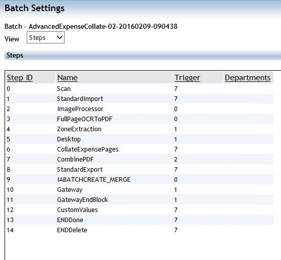
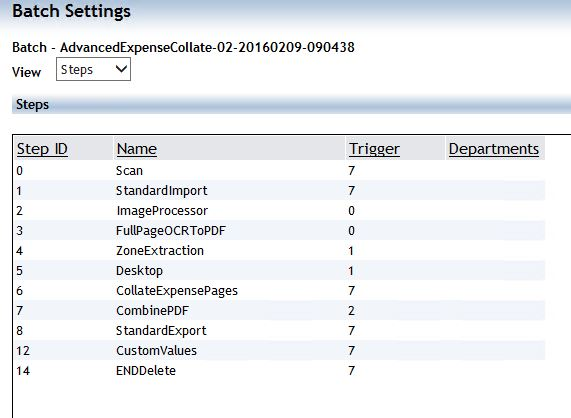

# Retriggering Batches in Bulk

Captiva 7.5 provides an option to retrigger or update the priority of batches in bulk. When a module errors - for example, ODBC Export losing its connection to the database - multiple batches can enter an error state, and resetting their priority manually is a painful task.

With Captiva 7.5, you can update or reset the batch IA value in bulk. Follow the steps below.

## Steps

1. Create a filter to select the batches that need to be updated. A batch filter can be created using the **Batch Filter** option under **Batch Finder**.

2. Open a Command Prompt and change the directory to:

   ```text
   C:\ProgramData\EMC\InputAccel\AdministrationConsole\bin
   ```

3. Launch the Admin Console tool **ACTool.exe**. This tool can retrigger a step or reset the priority of a batch.

## Usage

```text
ACTool domain\user,password@server,port option [parameters]

Valid options and parameters:
    Priority  : -p <priority> <filter_name>
    Retrigger : -r <step_name> <filter_name>
```

### Example: Reset Priority

If you created a filter named `ResetPriority`, the command would be:

```bat
ACTool.exe Captiva75\TestUser,TestPassword@Captiva75 -p 50 ResetPriority
```

Here, `50` is the priority to set for the batches, and `ResetPriority` is the name of the batch filter.

### Example: Retrigger a Step

```bat
ACTool.exe Captiva75\TestUser,TestPassword@Captiva75 -r Completion RetriggerCompletion
```

Here, `Completion` is the name of the step and `RetriggerCompletion` is the name of the batch filter.

---

## Hiding Internal Steps

Captiva 7.5 provides an option to hide internal steps - such as IABatchCreationMerge, Gateway, GatewayEndBlock, and ENDDone - from the Steps list for processes.






In the Captiva Administrator, check or uncheck the **Show Internal Steps** checkbox in **Default Settings** or **My Preferences** to show or hide internal steps.

![[Image]](images/20260503221012.png)

---

## Where Are the Captiva DLLs Stored?

This article explains where the DLLs used by various modules are stored.

## .NET Code DLL

All .NET Code module DLLs uploaded via the deployment files option in Captiva Designer are stored in the `tbl_modulevalues` table in the IA database.

For backward compatibility with version 6.x of the .NET Code Module, the 7.x version will also look in the local `InputAccel\Client\binnt` folder for the assembly if it cannot retrieve it from the IA Server first.

## Client-Side Scripting DLL

All client-side scripting DLLs used by modules such as ScanPlus, WSInput, Nuance, and Client Script Engine are stored in the `tbl_ModuleFiles` table in the IA database. The `MVModuleID` column in this table links each DLL to its corresponding client module.

---

## Captiva Batches Are No Longer Independent of the Captiva Process

In earlier versions of Captiva, once a batch was created, it copied all settings from the process. Any changes made to the process afterwards would not affect existing batches.

This behavior no longer applies to batches created in version 7.x and later, for the following reasons:

1. Modules such as Image Processor and Standard Export use profiles. Any changes to a profile will affect all batches using that profile, regardless of whether the batch was created before or after the change.

2. If an XPP uses script-behind code, that code is stored on the IA Server alongside the IAP and is not copied into batches. Changes to the script-behind code will therefore affect all batches. In Captiva 7.5, the designer warns that active batches exist and prevents deploying an updated process with the same name.

3. Similarly, for batches using the .NET Code module, any changes to the .NET Code module DLL affect all batches.

---

## Captiva Deployment Utility

In Captiva 7.x, deployment is typically performed through Captiva Designer. There is also a command-line utility for deploying various components of the Capture system to the Captiva server, which is useful for silent deployments.

**DeploymentUtility.exe** can be used as an alternative to Captiva Designer's **System > Deployment** functionality for uploading capture system files to the selected capture server from the command line.

This utility can also download capture system components from a specified capture server to a local folder on the client machine. Download works for all components except XPP.

## Command Line Format

```bat
DeploymentUtility.exe [-login:<username>,<password>@<IA_server>
  [-configurations:<list> or all]
  [-solution:<solution_name>]
  [-customfiles:<comma separated list of files>]
  [-overwriteworkflow:<true|false>]]
  [-argumentsfile:<file_name>]
  [-solutionpath:<capture solution path>]
  [-downloadfromserver:<true|false>]
  [-help]
```
