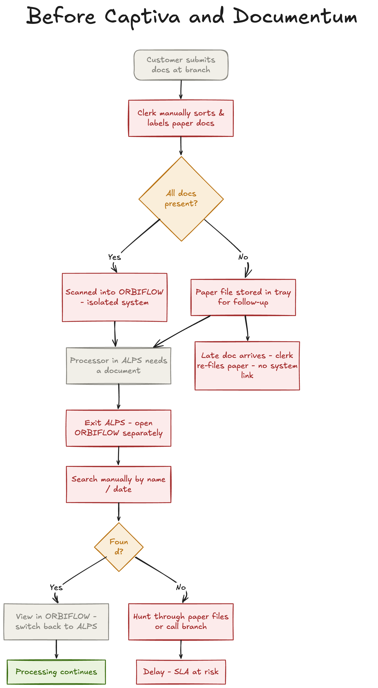
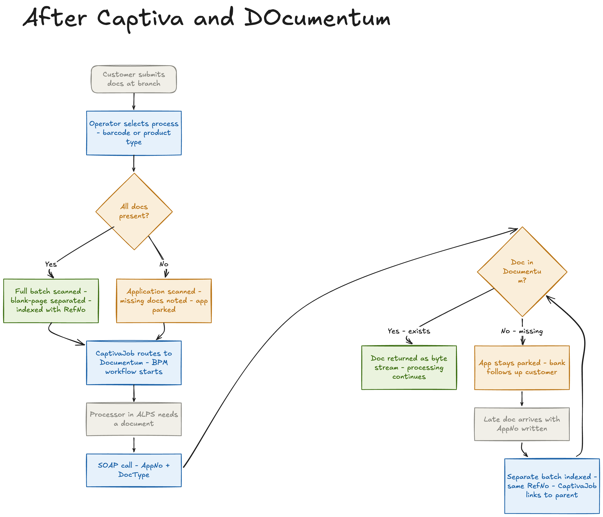
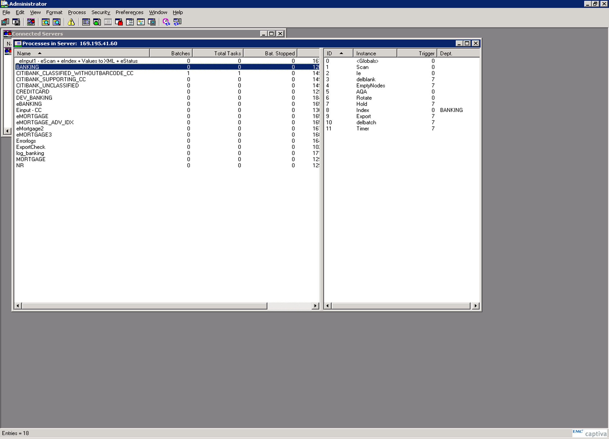
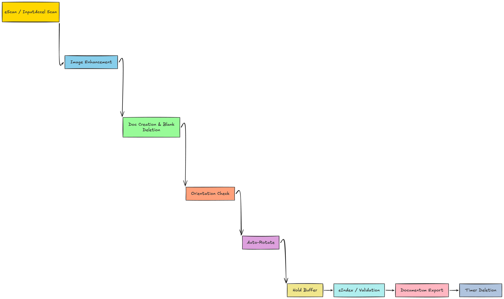
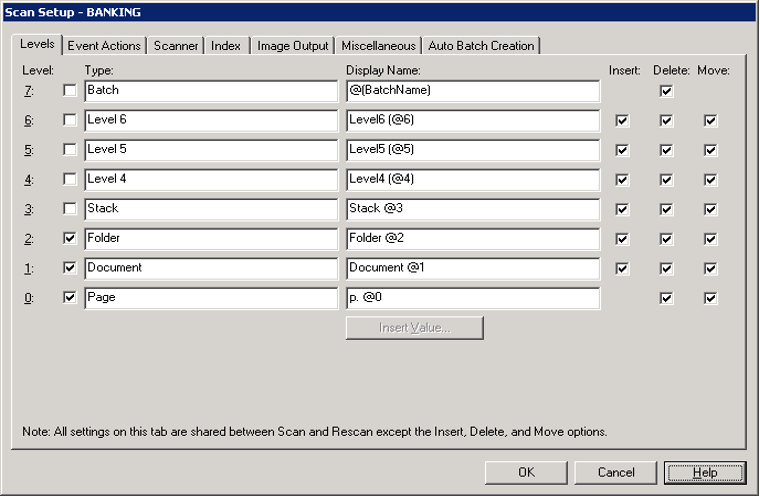
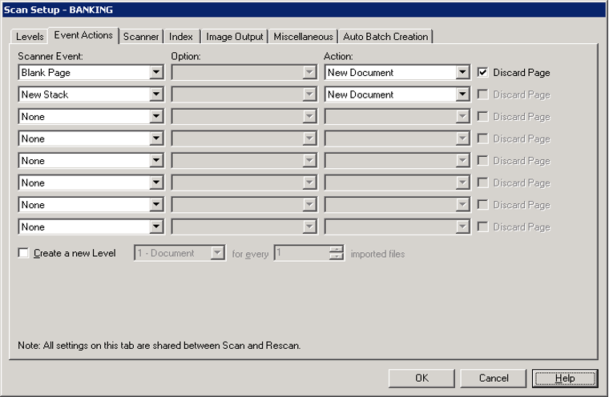
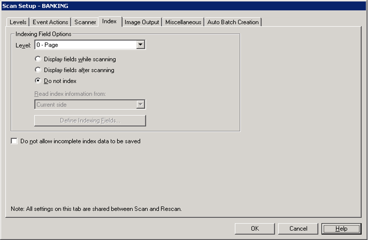
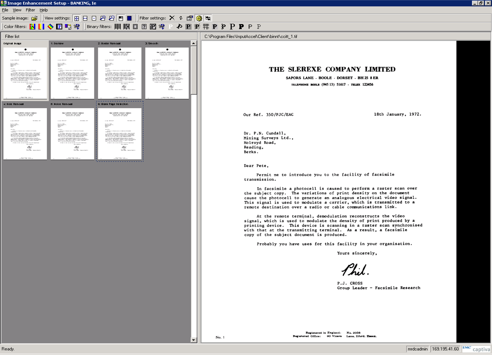
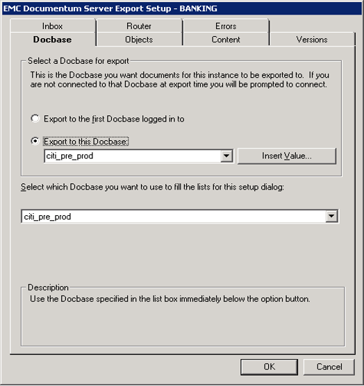
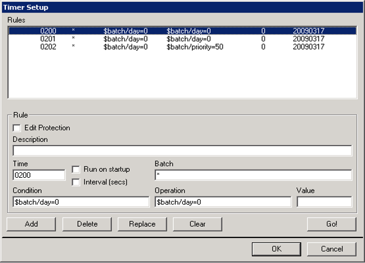

# AFU Data Capture and ECM Platform

**Project Name:** AFU (Application Fulfilment Unit) Data Capture and Enterprise Content Management Platform 
**Stream:** Loan Processing / Data Capture Solution
**Platform:**  Captiva InputAccel +  Documentum + ALPS
**My Role:** Principal Architect - solution design, module configuration, custom Java development, and system integration

---

## 1. Summary

The Application Fulfilment Unit (AFU) was a large-scale initiative to fully digitise a bank's document management lifecycle - from the moment a customer's application form arrived at the branch counter through to repository storage, downstream processing, and eventual lifecycle cleanup.

The core stack was  Captiva InputAccel for document capture and  Documentum as the content repository and BPM engine. These were integrated with the bank's internal loan processing platform, ALPS, via a custom Java background job and a SOAP/XML web service. I was responsible for the full solution - requirements through deployment.

The objective was clear: reduce operational cost, eliminate manual retrieval bottlenecks, and give the processing team real-time access to every document without leaving their primary system.







---

## 2. Business Overview

The AFU - Application Fulfilment Unit - is the operational core of the bank's retail lending back office. Every credit card application and mortgage loan application has to be received, classified, scanned, stored, and made available to the processing team. At the volumes this bank was operating at, that's a significant volume of paper moving through a significant number of hands.

Documents drive decisions here. A credit card application doesn't advance without supporting documents being verified. A mortgage doesn't get sanctioned without income proof, identity proof, and property documents in order. Every processing stage - credit decisioning, verification, sanctioning, disbursement - depends on the ability to locate and act on the correct document quickly.

The bank was handling all of this manually when I came on board. The scale of the operational cost was the primary driver for building AFU properly.

---

## 3. Business Document Model

### 3.1 Application Forms

Two product lines drive the document pipeline: credit card applications and mortgage (home loan) applications. Both are multi-page documents - sometimes spanning four or more pages - treated as a single logical unit in the system. Many forms carry a printed barcode used as the primary document separator mechanism.

### 3.2 Supporting Documents

Beyond the application form, customers submit a range of supporting documents: PAN Card, Form 16, Driving Licence, salary slips, bank statements, affidavits, birth certificates, audit rolls, and account opening forms. Each is a distinct entity linked to a parent application via the Application Number - the primary key across the entire document model.

### 3.3 Unclassified Documents

Not every document arriving at the branch can be immediately identified. Handwritten instructions, unfamiliar form types, or ambiguous submissions go into an unclassified queue and are classified by an operator during the indexing stage.

### 3.4 The Parent-Child Relationship and the Application Number

The document model is hierarchical. The application form is the parent; supporting documents are children. The Application Number maintains that link throughout the system.

Supporting documents don't always arrive with the original application. A customer might submit the application one day and the Form 16 several days later. When the supporting document arrives, the operator enters the Application Number in the `RefNo` field during indexing, and the system links it to the correct pending application across separate scanning sessions.

---

## 4. Real-World Business Scenarios

These weren't hypothetical scenarios - they were daily operational realities at the branch level.

**Scenario 1 - Complete submission.** Customer submits the application form and all supporting documents together. The full set is scanned in one batch, blank-page-separated, and everything is linked from day one.

**Scenario 2 - Supporting documents arrive later.** The application enters processing but is parked because documents are missing. The bank follows up, the customer sends the missing documents with the Application Number written on them, and they are scanned in a separate batch. The operator keys in the Application Number at index time and the supporting document is linked to its parent.

**Scenario 3 - No barcode on the form.** The operator knows the application type but the form doesn't carry a barcode. Separate Captiva processes are assigned per product type - one for Credit Card, one for Mortgage - and the process assignment itself carries the product type into the system.

**Scenario 4 - Unknown document type.** The branch receives something that can't be classified on sight. It goes through the Unclassified process into a manual indexing queue, where an operator reviews the image and assigns both the Application Form Type and Document Type.

---

## 5. What Was Broken Before We Built This

### 5.1 ORBIFLOW Was an Island

The bank already had a scanning setup. Scanned images went into a system called ORBIFLOW. The problem was that ORBIFLOW and ALPS - the loan processing platform - had no integration whatsoever. A processor working inside ALPS who needed to view a scanned document had to exit ALPS, open ORBIFLOW in a separate session, search manually, view the document there, and return to ALPS - repeated at every document retrieval across the entire processing chain.

### 5.2 Everything Was Manual

Grouping documents, indexing them, managing the supporting document types - all human-driven and error-prone. There was no structured metadata, no validated classification, and no reliable way to confirm that everything belonging to an application had been captured and stored.

### 5.3 SLAs Were Under Pressure

The bank had outsourced vendors accessing ALPS over dedicated leased lines. When one processing stage got delayed - because a document couldn't be located or a classification was wrong - it cascaded downstream. It was a systemic problem that required a systemic fix.

---

## 6. What We Set Out to Build

Three objectives. First, a controlled, automated document capture pipeline to replace paper handling. Second, an intelligent indexing and storage layer that structured every document with validated metadata. Third, a live integration with ALPS so that any processor, at any stage, could retrieve the document they needed without leaving their primary system.

---

## 7. The Business Flow in Plain Terms

A customer submits their application and supporting documents at a branch. The operator reviews what's in front of them - product type, barcode present or not, documents complete or incomplete - and makes an initial classification call. Documents are then arranged into a scan batch, with blank pages between each one to mark document boundaries.

The operator scans everything - either from a workstation on the bank's intranet using the thick client, or via a web browser using the eInput thin client, which made scanning possible from any location with an internet connection.

Scanned images pass through automatic cleanup: crooked pages are straightened, scanner artefacts removed, noise eliminated, and mis-oriented pages corrected. Documents with barcodes are classified automatically. Everything else - no barcode, supporting docs, unclassified - goes into an operator indexing queue where metadata is entered and confirmed.

Once indexed, all pages of a document are assembled into a single TIFF file and pushed to the Documentum repository. A background job routes each document to the correct folder and initiates the workflow. From that point, any ALPS processor can retrieve the document instantly using two parameters: the Application Number and the Document Type.

At 02:00 each morning, completed batches are deleted from the Captiva server automatically.

---

## 8. System Overview

### 8.1 The Three Platforms

** Captiva InputAccel** handles document capture. It operates as a process-based server with configurable module chains - Scan, Image Enhancement, Quality Check, Index, Export - through which documents flow sequentially. It supports both a thick-client scanner for intranet use and a thin-client web-based scanner for internet access.

** Documentum** is the permanent content repository. Documents are stored as typed objects in a hierarchical cabinet/folder structure with defined metadata attributes. Once a document lands in Documentum, the BPM engine routes it through the verification, approval, and processing workflow. Documentum also exposes the SOAP web services that ALPS uses to retrieve and update documents.

**ALPS** is the bank's internal loan processing system - where credit officers, processors, and vendor teams operate. Before AFU, it had no visibility into the scanned document world. After AFU, it could retrieve any document from Documentum on demand via a web service call.

### 8.2 Infrastructure

I originally architected the AFU platform on  Captiva InputAccel 5.3 and  Documentum 5.3 SP4, on AIX/Solaris with Oracle 10g and WebSphere 6.x/WebLogic 9.2. eInput ran through Internet Explorer; vendor access over leased lines.

The solution went live with 18 active capture processes and remained stable in production.

The stack was later upgraded to OpenText Captiva 7.x and Documentum 7.x, on RHEL with Oracle 19c. eInput moved off IE, the JSP silent login workaround was retired for native SSO, and vendor access moved to VPN.

The module chain, CaptivaJob, object model, and ALPS web service contract carried forward unchanged.


## 9. How Business Documents Map to the System

### 9.1 The Documentum Object Model

I created a custom Documentum object type for this project: `citibank_captiva_doc`. Every scanned document - credit card application form, mortgage application, or supporting document - lands in Documentum as an instance of this type, stored within a `dm_cabinet` → `dm_folder` hierarchy in the Docbase `citi_pre_prod`.

Three object sub-types capture the three document categories:

```
credit_card_app_form    - Credit Card application forms
mortgage_app_form       - Mortgage/Loan application forms
supporting_doc          - All supporting documents
```

The routing logic that decides which sub-type and which folder a document lands in is handled by the CaptivaJob - covered in Section 15.

### 9.2 The Intermediate Folder Pattern

Captiva exports all documents to a single shared intermediate folder in Documentum regardless of document type. The Captiva export module has no awareness of business routing - that responsibility belongs entirely to the CaptivaJob. The job reads the intermediate folder, inspects each document, determines the correct final location, moves it, and initiates the workflow. Clean separation of concerns.

### 9.3 File Naming Convention

The bank had an established naming standard from AFU Phase I. The new system had to follow it exactly for backward compatibility with the existing repository. The format:

```
B_S_BAN-TR-CC_App_03-02-01.tiff        (Credit Card Application Form)
B_S_BAN-TR-CC_F16_P_01.tiff            (Form 16 Supporting Document)
B_S_BAN-TR-ML_App_03-02-01.tiff        (Mortgage Application Form)
```

The `getNewObjectName()` method in the CaptivaJob derived the correct filename from the document's metadata.

### 9.4 Physical Scanning Standards

Operational conventions required for reliable system behaviour:

- Every document (all pages) is scanned as a single file named after the Application Number.
- All pages must be identical in physical size - mixed-size pages break the image assembly process.
- The first page of each logical document group carries a type sticker at a fixed, predefined coordinate. Subsequent pages carry no sticker.
- The sticker coordinate must be consistent across every first page - OCR zone extraction is position-dependent.

---

## 10. The Capture Pipeline - Conceptual Overview

A batch arrives from the scanner. Blank pages mark the document boundaries. Image enhancement filters clean up each page. An automated quality check catches and corrects mis-oriented pages. Documents needing human classification land in an operator queue; everything else flows through automatically. The index operator sees the image, enters or confirms the metadata fields, and the document is cleared for export.

Export assembles all pages of a document into a single multi-page TIFF, pushes it to Documentum, and holds the batch until every document in it has confirmed a successful export. The CaptivaJob then routes each document to its final folder, starts the workflow, and cleans up.

---

## 11. Detailed Captiva Process Design

### 11.1 What Was Running on the Server

Opening the InputAccel Administrator shows 18 active processes - each representing a specific combination of product type, document category, and capture mode.



| Process Name | Purpose |
|---|---|
| `BANKING` | The primary Banking process - thick-client flow for branch scanning |
| `DEV_BANKING` | Development/sandbox version of the Banking process |
| `eBANKING` | eInput-based thin-client version of the Banking process |
| `CREDITCARD` | Credit card application processing |
| `Einput - CC` | eInput variant for Credit Card |
| `CITIBANK_CLASSIFIED_WITHOUTBARCODE_CC` | Classified CC docs without barcode |
| `CITIBANK_SUPPORTING_CC` | Supporting docs for CC |
| `CITIBANK_UNCLASSIFIED` | Unclassified documents |
| `MORTGAGE` | Mortgage/loan application processing |
| `eMORTGAGE` / `eMORTGAGE_ADV_IDX` / `eMortgage2` / `eMORTGAGE3` | Various eInput mortgage process variants |
| `_eInput1 - eScan + eIndex + Values to XML + eStatus` | eInput pilot/test process |
| `Errorlogs` | Dedicated error logging process |
| `ExportCheck` | Export verification process |
| `log_banking` | Banking process logging |
| `NR` | Non-Resident banking process |

### 11.2 The BANKING Process Module Chain

The BANKING process is the core thick-client flow, used by branch operators and also by external scanning vendors who connected to InputAccel through a secure tunnel over the bank's network. The module sequence:



```
InputAccel Scan
        ↓
IE (Image Enhancement) - with Blank Page Detection
        ↓
Multi (Document Level Creation + Blank Page Deletion)
        ↓
AQA (Automatic Quality Assurance) - Orientation check
        ↓
Rotate (Auto-rotate based on AQA result)
        ↓
Hold (Queue buffer before Index)
        ↓
Index (Validation-based Indexing)
        ↓
DctmExp / Export ( Documentum Server Export)
        ↓
Timer (Scheduled Batch Deletion at 02:00)
```

### 11.3 Scan Module Configuration

The batch tree hierarchy configured in the Scan Setup (Levels tab):

| Level # | Type | Display Name |
|---|---|---|
| 7 | Batch | @{BatchName} |
| 6 | Level 6 | Level6 (@6) |
| 5 | Level 5 | Level5 (@5) |
| 4 | Level 4 | Level4 (@4) |
| 3 | Stack | Stack @3 |
| 2 | Folder | Folder @2 |
| 1 | Document | Document @1 |
| 0 | Page | p. @0 |

The critical setting is in the Event Actions tab. **Blank Page** events trigger a **New Document** action - this is how the physical blank-page separator becomes a logical document boundary in the batch tree. New Stack also triggers New Document.

Other configuration:

- Binary colour format, **CCITT Group 4** compression - standard for B&W document imaging, lossless.
- Thumbnail size: Standard.
- Page side rotation: 0 degrees front and back.
- Primary and Secondary Process schema: both `BANKING`.
- Automatically delete empty batches: enabled.
- Batch page limit: 8000 pages for 16-bit modules.







### 11.4 Image Enhancement (IE) Module

Six filters applied sequentially to every scanned page:

| Filter # | Name | Purpose |
|---|---|---|
| 1 | Deskew | Straightens pages scanned at a slight angle |
| 2 | Border Removal | Removes scanner bed artefacts at page edges |
| 3 | Smooth | Smooths jagged character edges |
| 4 | Hole Removal | Removes punch-hole artefacts |
| 5 | Noise Removal | Eliminates random pixel noise |
| 6 | Blank Page Detection | Identifies blank separator pages for downstream deletion |

The IE module provides a real-time preview in its setup UI - loading a sample document image shows the before/after effect of each filter. This was used extensively during configuration to tune the chain against the actual document stock being scanned.



### 11.5 Multi Module - Document Levelling and Blank Page Deletion

The Multi module serves two purposes. First, it physically removes blank separator pages from the batch - they've served their purpose (triggering the New Document event) and are no longer needed. Second, it ensures the correct document level hierarchy is maintained in the batch tree as pages flow downstream.

The three-stage sequence - IE detects the blank page → Scan's event action creates the document boundary node → Multi deletes the physical blank page - keeps each module's responsibility clearly bounded and avoids timing ambiguity in the pipeline.

### 11.6 AQA Module - Automatic Quality Assurance

Only the Orientation check is enabled here. Noise and Skew checks are off.

The primary quality risk at these scanning stations was documents being placed in the scanner tray upside-down or at 90 degrees - not skew, which operators were generally careful to avoid. The Orientation test catches exactly that, flagging mis-oriented pages before they reach the indexing queue.

### 11.7 Rotate Module

A second AQA-type module configured specifically for auto-rotation correction. The output of the Orientation check in AQA feeds directly into this module, which physically corrects any mis-oriented pages. By the time a page exits Rotate, it is guaranteed to be upright.

### 11.8 Hold Module

A queue buffer between the automated processing side and the operator-driven indexing side. It holds documents until an index operator picks them up - an explicit staging point for the handoff between automated and manual phases.

### 11.9 Export Module -  Documentum Server Export

**Docbase tab:**
- Export mode: **Export to this Docbase** (pinned, not first logged-in)
- Target Docbase: **`citi_pre_prod`**

**Objects tab:**
- Create/Search by object name
- Object hierarchy: `dm_cabinet` → `dm_folder` → `citibank_captiva_doc`

**Content tab:**
- Export mode: **Export image files**
- File Type: **TIFF (*.TIF)**
- Colour Format: **Binary**
- Compression: **CCITT Group 4**
- Multi-Page: **Enabled** - all pages assembled into one TIFF per document
- Merge Annotations: Disabled
- Content Type: `tiff`

**Errors tab:**
- If document already exported: **Replace - export document again**
- On error: **Automatically retry 1 time**
- If retry fails: **Prompt user** (Abort / Continue / Stop)

The "Replace on re-export" setting is an idempotency decision - if a batch fails mid-export and is reprocessed, documents that already made it through are cleanly overwritten rather than duplicated, leaving no orphaned objects in the repository.

The enforced rule: **a batch is never marked ready for deletion until every single document in it has confirmed a successful export.** One failed image means the entire batch is retained.



### 11.10 Timer Module - Scheduled Batch Deletion

Three rules, firing from 02:00 each morning:

| Rule ID | Time | Condition | Operation |
|---|---|---|---|
| 0200 | 02:00 | `$batch/day=0` | `$batch/day=0` |
| 0201 | 02:01 | `$batch/day=0` | `$batch/day=0` |
| 0202 | 02:02 | `$batch/day=0` | `$batch/priority=50` |

`$batch/day=0` matches same-day batches that are fully processed and ready for cleanup. Rule 0202 sets priority to 50 on deletion tasks - this prevents deletion runs from competing with live scanning and export activity during that early-morning window.

Before the timer was in place, batch cleanup was manual - a dependency that creates accumulation risk over time. The timer removed it entirely.


---

## 12. Indexing Design

### 12.1 The Six Fields

Six indexing fields were configured for the BANKING process, derived from discussions with the business team about what metadata was actually needed to retrieve and route documents:

| Field # | Name | Type | Level | Validation / Picklist |
|---|---|---|---|---|
| 01 | **RefNo** | Edit (free text) | 1 – Document | Length: 10–16 characters; Auto-Validate |
| 02 | **BusinessType** | Picklist | 1 – Document | Default: `BAN`; List: `BAN`; Pre-validates on field load; Only list selections allowed |
| 03 | **DocumentType** | Picklist | 0 – Page | Extensive list; Pre-validates on field load; Only list selections allowed |
| 04 | **TransactionType** | Picklist | 0 – Page | Extensive list; Pre-validates on field load; Only list selections allowed |
| 05 | **Priority** | Picklist | 0 – Page | Picklist of priority levels |
| 06 | **Holder** | Picklist | 0 – Page | Default: `1`; List: 1, 2, 3, 4, 5, 6, 7, 8, 9, 99; Pre-validates on field load |


### 12.2 Picklist Values

**DocumentType picklist** (partial, from live system):
```
bank_acc_app_form, atm_charge_slip, affidavit, late_st_annual_return,
aof, approvals, audit_rolls, bankers_attestn, birth_certificate,
business_continuity_doc, ...
```

**TransactionType picklist** (complete, from live system):
```
AO, LIAPP, SRK, CSP, PAP, PLI, MLI, HPP, HLTF, PA, HC, TR, SC, IOC,
HS, SWP, DMACCLS, OP, STP, SUVPR, RCSF, RCMIFT, ALOP, BLOP, CI, CCL
```

### 12.3 Three Levels of Metadata

The index schema captures metadata at three granularities:

**Batch level** - Branch information via a combo box. One value per batch, shared across all documents in it.

**Document level (Level 1)** - `RefNo` and `BusinessType`. Assigning `RefNo` at the document level (not page level) is what enables the system to link supporting documents to parent applications reliably.

**Page level (Level 0)** - `DocumentType`, `TransactionType`, `Priority`, and `Holder`. Per-page granularity for multi-document-type submissions.



### 12.4 Validation Design

`Pre-Validate when fields are loaded` on all picklist fields means validation runs immediately on opening the index screen - stale or invalid selections are caught before the operator invests time in the remaining fields.

`Only allow selections from list` is a hard constraint. No freeform text on picklist fields. The TransactionType and DocumentType values feed directly into the CaptivaJob's routing logic and into the Documentum folder structure. A value that doesn't match a known entry means the document cannot be routed.

The Index module is the only module in the pipeline that deliberately holds a document on error rather than passing it forward. An indexing error means incomplete or incorrect metadata - forwarding that document to Documentum would corrupt the repository's data integrity. It must be resolved at the source.

---

## 13. The eInput Flow

### 13.1 Why a Separate Path Was Needed

The thick-client InputAccel Scan module requires client software installed on the scanning machine and a direct intranet connection to the Captiva server. That works well for branches with dedicated scanning workstations. For remote offices, field teams, and satellite branches without that infrastructure, eInput was the answer.

eInput is Captiva's web-based thin client. eScan runs in Internet Explorer, connects to the eInput web server over HTTPS, and forwards batches to the InputAccel server. No client installation. No VPN requirement.

The eInput module chain:

```
eScan (with Quality Check, blank page detection, and image processing)
        ↓
IE (Image Enhancement - with blank page detection)
        ↓
Multi (Blank page deletion + Document level creation + Batch deletion)
        ↓
eIndex (Validation-based indexing)
        ↓
DctmExp (Documentum Export - dedicated separate instance)
        ↓
Timer (Timer-based batch deletion)
```

Additional capabilities eInput provided: offline scanning and indexing (batches synchronise when connectivity returns), private batch mode (same operator scans and indexes - enforced by the system), image streaming for large file preview, and image annotations.

### 13.2 Two Key Architectural Decisions

**Dedicated export instance.** The eInput flow uses a completely separate export module instance from the BANKING thick-client process. The two capture paths have different folder routing logic, different metadata attributes, and different timing characteristics. Sharing one export instance would have introduced configuration conflicts and potential document misrouting.

**No AQA in the eInput chain.** In the thick-client flow, AQA sits downstream of IE and handles orientation detection and auto-rotation. In the eInput flow, quality checking was moved into eScan itself. AQA is designed for use with the traditional InputAccel Scan module and has known compatibility issues when placed downstream of eScan. Moving quality checks into eScan avoids that architectural mismatch entirely.

### 13.3 Enhancement - Silent Login for eScan and eIndex

One friction point that emerged once operators started using the eInput thin client was the login screen. Every time someone launched eScan or eIndex in the browser, they had to manually enter username, password, server, domain, and department. For operators launching these tools repeatedly throughout the day - particularly in shared workstation environments - this was a meaningful time cost. There was also a deployment requirement to launch eScan or eIndex from another system with credentials passed automatically.

The solution was silent login - credentials passed as URL query parameters so the application could log in without presenting the login dialog.

This required direct modifications to three JSP files in the eInput web application: `Scan.jsp`, `Index.jsp`, and `einput.jsp`.

#### Step 1 - Scan.jsp and Index.jsp: Reading Credentials from the URL

In both files, the following JavaScript functions were inserted immediately after the line `// TODO: Set these global variables using jsp, asp etc ...`. JSP expression tags read the incoming HTTP request parameters server-side and expose them as JavaScript functions:

```javascript
function getName() {
    return '<%= request.getParameter("user") != null ? request.getParameter("user") : "" %>';
}

function getServer() {
    return '<%= request.getParameter("server") != null ? request.getParameter("server") : "" %>';
}

function getPwd() {
    return '<%= request.getParameter("pwd") != null ? request.getParameter("pwd") : "" %>';
}

function getDomain() {
    return '<%= request.getParameter("domain") != null ? request.getParameter("domain") : "" %>';
}

function getDepartment() {
    return '<%= request.getParameter("department") != null ? request.getParameter("department") : "" %>';
}
```

`request.getParameter()` runs server-side at page load. If the parameter is present in the URL, its value is embedded directly into the function's return value as a literal. If absent, the function returns an empty string.

#### Step 2 - einput.jsp: The Silent Login Function

After the `OnNewBatch` function (around line 517), a new function `OnSilientLogin` was added:

```javascript
function OnSilientLogin() {
    ShowWaitCursor();
    try {
        if (http == null)
            http = GetXmlHTTP();

        var prefix = "";
        if (window.top.g_strUIMode == "Scan")
            prefix = LOGIN_PREFIX;
        else
            prefix = INDEX_LOGIN_PREFIX;

        http.open('GET', prefix + 'user=' + escape(window.top.getName())
            + '&pwd=' + escape(window.top.getPwd())
            + '&server=' + escape(window.top.getServer())
            + '&domain=' + escape(window.top.getDomain())
            + '&department=' + escape(window.top.getDepartment()), false);

        http.onreadystatechange = handleHttpValidateLogin;
        http.send(null);

        window.top.frames["ControlPanelFrame"].LoginRetFunc(
            window.top.g_CachedMode ? OFFLINE : "online"
        );
    }
    catch (e) {
        loggedIn = false;
        ShowErrorAlert("Exception", e.name, e.number, e.description, null, true);
    }

    ShowAutoCursor();
    return loggedIn;
}
```

This makes a synchronous HTTP GET to the InputAccel server's login endpoint, passing credentials from the URL. The `g_strUIMode` check handles the difference between eScan and eIndex login prefixes. On success, `LoginRetFunc` is called with `"online"` (or `OFFLINE` in cached mode), completing authentication without showing the login dialog.

#### Step 3 - einput.jsp: Replacing OnLogin

The original `OnLogin` function always showed the login popup. The replacement checks for URL credentials first and only falls back to the popup if silent login fails or no credentials were provided:

```javascript
function OnLogin(Title, ContentID) {
    window.top.hidePopWin(false);

    var tdWorkOffline = window.top.frames["ControlPanelFrame"]
        .document.getElementById("tdWorkOffline");

    if (window.top.g_strUIMode == "Index") {
        if (tdWorkOffline != null)
            tdWorkOffline.style.display = "none";
    } else {
        if (tdWorkOffline != null)
            tdWorkOffline.style.display = "inline";
    }

    if (!window.top.g_CachedMode)
        window.top.g_CachedMode = !navigator.onLine;

    if ((window.top.AdvancedIndexingDocID != null && window.top.AdvancedIndexingDocID != "")
        || window.top.g_CachedMode
        || (window.top.g_IsOpened && IsLoggedIn())) {
        window.top.frames["ControlPanelFrame"].LoginRetFunc(
            window.top.g_CachedMode ? OFFLINE : "online"
        );
        return;
    }

    var oIaLoginModuleName = window.top.frames["ControlPanelFrame"]
        .document.getElementById("IaLoginModuleName");
    if (oIaLoginModuleName != null) {
        if (window.top.g_strUIMode == "Scan")
            oIaLoginModuleName.innerText = "eScan";
        else if (window.top.g_strUIMode == "Index")
            oIaLoginModuleName.innerText = "eIndex";
    }

    var oIaLoginModuleVersion = window.top.frames["ControlPanelFrame"]
        .document.getElementById("IaLoginModuleVersion");
    if (oIaLoginModuleVersion != null) {
        oIaLoginModuleVersion.innerText = EINPUT_VERSION_VALUE;
    }

    GetAutocompleteLoginField(window.top.frames["ControlPanelFrame"]
        .document.getElementById("selectServer"));
    GetAutocompleteLoginField(window.top.frames["ControlPanelFrame"]
        .document.getElementById("selectUserName"));
    GetAutocompleteLoginField(window.top.frames["ControlPanelFrame"]
        .document.getElementById("selectDomain"));

    if (window.top.getServer() == '' || window.top.getName() == '')
        window.top.showPopWin(
            window.top.frames["ControlPanelFrame"].document.getElementById(ContentID),
            Title, 400, 280, LoginRetFunc, null, false
        );
    else {
        if (OnSilientLogin() == false)
            window.top.showPopWin(
                window.top.frames["ControlPanelFrame"].document.getElementById(ContentID),
                Title, 400, 280, LoginRetFunc, null, false
            );
    }
}
```

If `getServer()` and `getName()` both return non-empty strings, `OnSilientLogin()` is attempted. If it succeeds, the operator lands directly in the scanning or indexing interface. If it fails, the standard login popup appears. If no credentials were in the URL, the popup appears immediately. Normal behaviour is fully preserved.

#### Usage

```
# Launch eIndex with silent login
http://localhost:8084/eInput/Index.jsp?server=localhost&user=mishum&pwd=741

# Launch eScan with silent login
http://localhost:8084/eInput/Scan.jsp?server=localhost&user=mishum&pwd=741
```

All five parameters supported:

| Parameter | Description |
|---|---|
| `server` | InputAccel Server hostname or IP |
| `user` | Username |
| `pwd` | Password |
| `domain` | Windows domain (optional) |
| `department` | User department (optional) |

Full form:
```
http://localhost:8084/eInput/Scan.jsp?server=localhost&user=mishum&pwd=741&domain=corp&department=main
```

This made it practical to generate pre-populated launch URLs per operator from a portal or intranet page - the operator clicks a link and lands directly into eScan or eIndex, already authenticated.

---

## 14. The Documentum Integration - How ALPS Gets Its Documents

Before AFU, an ALPS processor who needed a document had to exit ALPS, log into ORBIFLOW separately, search manually, view the document there, and return to ALPS. This added friction at every processing stage, multiplied across every processor and every application. The AFU integration eliminates it. Documents are available inside ALPS, on demand, at any stage, via a web service call.

### 14.A The Web Service Design

Documentum exposes two service operations via SOAP/XML - a strongly-typed, auditable messaging protocol well-suited to enterprise banking integration. The ALPS team could consume the service regardless of their underlying stack.

The service contract defines:
- **Service endpoint:** A URL hosted on the Application Server (WebSphere/WebLogic).
- **Request format:** An XML-structured SOAP message with two mandatory parameters - Application Number and Document Type.
- **Response format:** A SOAP response carrying the document as a byte stream, or a status acknowledgment for attribute updates.
- **Message transport:** XML over HTTPS.

The contract follows a WSDL-style definition, enabling the ALPS development team to generate client stubs and bind to the service programmatically.

### 14.B The Request-Response Flow

```
Step 1: ALPS identifies that a document is required at a processing stage.
        It prepares a SOAP request containing:
            - Application Number (the unique reference linking the document)
            - Document Type (specifies which document to retrieve)

Step 2: ALPS dispatches the SOAP/XML request over HTTPS to the
        Documentum web service endpoint on the Application Server.

Step 3: The Application Server receives the request. The DFC layer
        authenticates using server-to-server credentials and opens
        a session with the Documentum Content Server.

Step 4: The Content Server searches the repository (Docbase:
        citi_pre_prod) for the document matching the Application
        Number and Document Type parameters.

Step 5: The matching TIFF object is located in the
        dm_cabinet/dm_folder/citibank_captiva_doc hierarchy.

Step 6: The document content is retrieved and returned to the
        Application Server.

Step 7: The Application Server encodes the document as a byte
        stream within the SOAP response envelope and returns it
        to the calling ALPS system.

Step 8: ALPS receives the byte stream and renders the document
        image for the operator within the ALPS interface.
```

### 14.C Handling Large Files

Multi-page mortgage applications with multiple supporting documents produce substantial TIFF files. To handle large files within the SOAP framework without causing transport-layer size violations or timeouts, document content is split into chunks at the Documentum end using standard splitting APIs. Chunks are transmitted sequentially. At the ALPS end, a corresponding reassembly mechanism reconstructs the complete TIFF before rendering. Both sides use the same standard APIs, so reconstruction is deterministic and lossless.

### 14.D Authentication

All communication between ALPS and Documentum uses server-to-server authentication. The ALPS application server authenticates itself to the Documentum Application Server using shared system-level credentials - not individual user credentials. Authentication happens at the service call level, making access controlled and auditable at the system boundary regardless of which user is logged into ALPS. Additional security controls were enforced per the bank's enterprise security policy.

### 14.E The Two Operations

**Retrieve document:** An ALPS operator at any processing stage needs a customer's Form 16 for a mortgage application. ALPS sends the SOAP request with the Application Number and Document Type `supporting_doc`. Documentum locates and returns the TIFF. The operator sees the image inside ALPS within 2 seconds above baseline response time.

**Update document attributes:** An operator marks a document as "Verified" or adds a processing remark. ALPS invokes the attribute update operation with the Application Number, Document Type, and updated values. Documentum updates the metadata on the `citibank_captiva_doc` object, and the updated state is visible to all subsequent processing stages.

### 14.F Why This Integration Matters

ORBIFLOW and ALPS operated as two disconnected systems. Every document retrieval required a manual switch between them. The Documentum-ALPS web service integration eliminated that dependency. Documents are accessible in real time, from within ALPS, at every processing stage, bidirectionally - ALPS can retrieve and update, not just read. The SOAP/XML interface is platform-independent, and the server-to-server authentication model keeps credentials contained within system boundaries.

### 14.G Deployment

The Documentum web service was deployed as an EAR module on the Application Server (WebSphere/WebLogic). DFC was installed on the same machine before deployment - it's the library the web service uses to communicate with the Content Server. The Application Server and Content Server ran on separate UNIX boxes.

---

## 15. The CaptivaJob - Custom Java Processing

### 15.1 Purpose

Captiva's DCTM Export module deposits documents into a single shared intermediate folder in Documentum. Every document - credit card forms, mortgage forms, supporting docs - lands there first. The business required each document in its specific final folder, classified by product and document type, with the BPM workflow triggered immediately after placement. The CaptivaJob is the custom scheduled Java background job that handles all of that post-export routing.

### 15.2 Class Hierarchy

```
com.citibank.afu.methods.captiva
    └── CaptivaJob  (extends CtbMethodBaseCaptiva)
            └── CtbMethodBase  (abstract base)
```

### 15.3 Methods

| Method | Description |
|---|---|
| `void execute(String[] arg)` | Entry point; orchestrates the full document routing workflow |
| `boolean isTypeValid(String objType)` | Validates the Documentum object type against known types |
| `void createDocument(IDfSession, IDfSysObject, boolean, String)` | Creates/moves document to correct folder with all attributes |
| `void createWorkFlowInstance(String, String, String)` | Instantiates the Documentum BPM workflow for the placed document |
| `void cleanMigratedDocuments()` | Removes successfully processed documents from the intermediate folder |
| `void doDelete(IDfSession, IDfSysObject)` | Deletes a document object from the session |
| `String getNewObjectName(IDfSession, IDfSysObject)` | Derives the final document name per naming conventions |
| `String getNewObjectLocation(IDfSession, IDfSysObject, String)` | Determines the target Documentum folder path by document/application type |
| `String doExport(IDfSysObject, String, String, String, IDfSession, int)` | Executes the export from intermediate to final location |
| `void executeOperation(IDfOperation)` | Runs a DFC operation with error handling |
| `void deleteTIFFiles(String)` | Cleans up local TIFF files after successful migration |

### 15.4 Supporting Classes

| Class | Role |
|---|---|
| `CtbMethodBase.java` | Abstract base: session lifecycle, date/time helpers, `execute()` contract |
| `SaveOutput.java` | Redirects and captures job output streams for logging |
| `Constants.java` | Central static configuration constants |
| `PropertyLoader.java` | Singleton for loading the configuration property file |

### 15.5 Object Types Used

```
credit_card_app_form    - Credit Card application forms
mortgage_app_form       - Mortgage/Loan application forms
supporting_doc          - All supporting documents
```

---

## 16. Exception Handling and Reporting

### 16.1 The Error Handling Framework

Every module in the pipeline has a defined, explicit error behaviour. In an audited banking environment, silent failures are not acceptable.

| Module | Client-Side Error Action | Server-Side Error Action |
|---|---|---|
| **Scanning** | Display error to user | Generate error report |
| **Image Enhancement** | - | Log error; move document to next module |
| **DelBlank** (Blank page deletion) | - | Log error; move document to next module |
| **Empty Nodes** (IE to AQA transition) | - | Log error; move document to next module |
| **AQA & Rotate** | - | Log error; move document to next module |
| **Hold** | - | Log error; move document to next module |
| **Index** | Display validation errors to user for correction | Log error; **do NOT move to next module** (operator must resolve) |
| **Export** | - | Log error; reschedule for re-export on recoverable errors; **never mark batch for deletion until export confirmed** |
| **DelBatch** | - | Log error |
| **Timer** | - | Log error |

Index is the only module that deliberately holds on error rather than passing forward. A processing error in image enhancement or quality checking doesn't compromise metadata - it can be retried. An indexing error means the metadata is wrong or missing, and forwarding that document to Documentum would corrupt the repository. It is resolved at the source or it goes nowhere.

### 16.2 Report Formats

**Scan Report:**
```
User Id      :
Batch No     Document Name     Pages     Date & Time
```

**Export Report:**
```
User Id      :
Batch No     Document Name     Pages     Date & Time
```

**Debug/Error Log:**
```
[Date & Time] - [User Id] - [Process Name] - [Module Name] - [Batch Id/Name] - [Document Name] - [Node Id] - [Error/Debug Message]
```

These formats allow full reconciliation between documents scanned and documents successfully exported - a requirement for audit. The scanning and indexing User IDs do not need to match, which reflects the operational reality of different operators at different stations. Reports are generated at every process level, not just pipeline end.

---

## 17. End-to-End Technical Flow

```
 1. Customer submits application + supporting documents.

 2. Bank operator performs manual pre-classification:
    - Product type: Credit Card or Mortgage?
    - Does the form have a barcode?
    - Are supporting documents present and complete?

 3. Documents are arranged in batches.
    - Blank separator pages inserted between individual documents.
    - All pages within one document are contiguous.

 4. Operator opens InputAccel Scan (thick client) or eScan (eInput thin client).
    - Selects the correct process (BANKING, MORTGAGE, etc.)
    - Creates a new batch and scans all documents.
    - On detecting a blank page → New Document event fires → document boundary recorded.

 5. IE processes each page:
    - Deskew → Border Removal → Smooth → Hole Removal → Noise Removal
    - Blank Page Detection marks blank separator pages.

 6. Multi module:
    - Deletes all detected blank pages.
    - Creates document level nodes in the batch tree.

 7. AQA module:
    - Runs Orientation check on every page.
    - Flags mis-oriented pages for correction.

 8. Rotate module:
    - Auto-rotates any pages flagged by AQA.

 9. Hold module:
    - Queues documents for the Index operator.

10. Index module:
    - Operator views image and enters/confirms:
        RefNo (application number, 10–16 digits)
        BusinessType (from picklist - default BAN)
        DocumentType (from picklist - e.g. bank_acc_app_form, affidavit, etc.)
        TransactionType (from picklist - e.g. TR, CC, MLI, etc.)
        Priority (from picklist)
        Holder (from picklist - 1 to 99)
    - Validation enforced on every field before document can advance.
    - Index errors hold the document - do not advance to export.

11. Export module (DCTM Export):
    - Connects to Docbase: citi_pre_prod.
    - Assembles multi-page TIFF (CCITT Group 4, Binary, Multi-Page enabled).
    - Creates/searches citibank_captiva_doc object in dm_cabinet/dm_folder hierarchy.
    - Uploads TIFF to intermediate folder in Documentum.
    - On error: automatically retries once; on retry failure: prompts operator.
    - Batch NEVER marked for deletion until all documents confirm successful export.

12. CaptivaJob (scheduled Java background job):
    - Reads documents from intermediate Documentum folder.
    - Validates document type (isTypeValid).
    - Determines final folder path (getNewObjectLocation).
    - Creates/moves object to correct folder with all attributes (createDocument).
    - Instantiates Documentum BPM workflow (createWorkFlowInstance).
    - Cleans up intermediate folder entries (cleanMigratedDocuments).
    - Deletes local TIFF temp files (deleteTIFFiles).

13. Documentum BPM workflow:
    - Routes document through downstream verification, approval, and processing stages.

14. ALPS system (loan processing):
    - Invokes Documentum web service (SOAP/XML) with Application No. + Document Type.
    - Receives document as byte stream (large files are split and reassembled).
    - Updates document attributes via secondary web service as processing progresses.

15. Timer module (02:00 daily):
    - Fires rules 0200, 0201, 0202 in sequence.
    - Deletes all batches meeting the day=0 condition.
    - Sets batch priority to 50 for deletion tasks.

16. Scan and Export reports generated at every stage for reconciliation and audit.
```

---

## 18. Non-Functional Requirements

| Requirement | Specification |
|---|---|
| Web service response time | ≤ 2 seconds above baseline ALPS response time |
| System availability | All working days including Saturdays |
| Downtime | Scheduled and ad-hoc maintenance only |
| Image format | TIFF, Binary, CCITT Group 4 compression |
| Export retry on network error | 1 automatic retry before operator prompt |
| Batch deletion safety | No deletion until all documents in batch confirmed exported |
| Disaster recovery | Physical documents available as fallback during extended outages |
| Security | Enterprise security policy; server-to-server auth on web service |
| Scan reports | Generated at all process levels for full reconciliation |

---

## 19. Licensing

| License Code | Module | Purpose |
|---|---|---|
| IASCAN | Scan | Document scanning |
| IAIPI | Image Enhancement | Image processing + barcode detection |
| IA Index | Index | Operator-driven and automatic indexing |
| IAEXIMG | Image Export | Multi-page TIFF creation |
| IAEXDM | DCTM Export | Documentum export (one license per instance - relevant for the dedicated eInput export) |
| IAMULTI | Decision Making (Multi) | Document routing and blank page handling |

---

## 20. Authentication and Access Control

User authentication runs through Windows Domain User ID, as configured in the Captiva InputAccel Server administration module. Integration with SSO or ARMOR was explicitly out of scope.

Role-based access was enforced at the process level. Different user groups had access to different Captiva modules based on their role. Index access was segmented by product - operators in the Credit Card stream did not have access to the Mortgage queue and vice versa. Separate processes per product type made this straightforward to enforce.

---

## 21. What This Project Achieved

The solution went into production with 18 active processes covering all product types, document categories, and capture modes.

A few design decisions proved particularly important in practice:

The blank-page-as-separator model worked because responsibility was cleanly split across three modules - IE detects, Scan acts, Multi deletes. No single module was doing too much, and operators didn't need to change anything about how they physically prepared batches.

The "never delete until fully exported" rule prevented an entire class of unrecoverable data loss. Without it, a network interruption mid-export could delete a batch from Captiva before it had confirmed landing in Documentum.

The ALPS web service integration is what distinguishes AFU from a simple document archive. Documentum becomes an active participant in the loan processing workflow - documents retrieved on demand, attributes updated as processing progresses.

---

*Das*