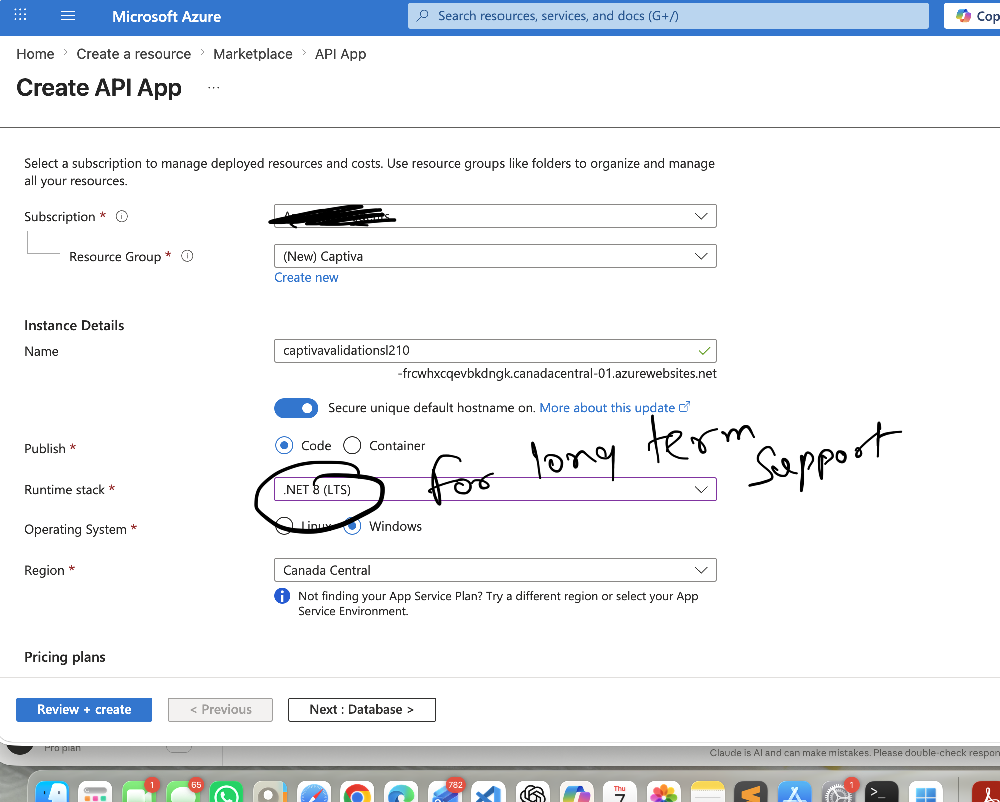
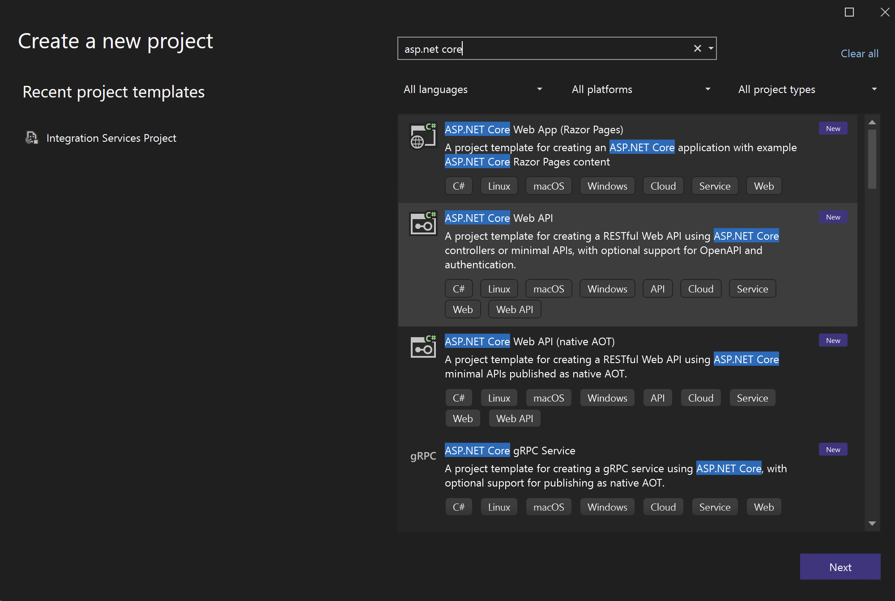

---

# Upgrading a Legacy SOAP Integration to REST on Azure
## A Step-by-Step Approach — AFU Project Case Study

**By Dwaipayan Das**

---

## Background

In the AFU project, I had a SOAP web service (`Service1.asmx`) deployed on an on-premises Windows server. It validated account numbers against Oracle during Captiva document indexing. When the bank moved to Azure and Captiva was upgraded to 16.x, I needed to:

i) Replace Oracle with Azure SQL.

ii) Replace the ASMX SOAP service with a REST API on Azure App Service.

iii) Replace the IndexPlus `IFieldEvents` scripting with Completion module scripting.

iv) **Not change anything the operator sees.**

This is the step-by-step approach I followed.

---

## The Core Principle Before Anything Else

Before touching any code, I identified what could not change:

- The three validation rules — account check, populate, expiry date.
- The response codes — `1000`, `1001`, `1002`, `1003`, `9999`.
- The Captiva field being validated — `RefNo`.
- The output fields — `CL0_eICVPrOTxt`, `CL0_eICVPrOTxt2`.
- The operator experience — same messages, same pass/fail behaviour.

Everything else was replaceable. This list became the test criteria at the end.

---

## Step 1 — Create the Azure SQL Database

Before building the service, the database needs to exist.

i) In the Azure Portal, go to **Create a resource** → **SQL Database**.

ii) Create a new server or use an existing one.

iii) Note down:
- Server name: `[your-server].database.windows.net`
- Database name
- Admin user ID and password

iv) Once created, open **Query Editor** in the portal and create the stored procedure. This is a direct T-SQL port of the original Oracle `CALLSL210PQ`:

```sql
CREATE PROCEDURE [dbo].[CALLSL210PQ]
    @branch_cd   NVARCHAR(200),
    @product_cd  NVARCHAR(200),
    @account_no  NVARCHAR(200),
    @holder_no   NVARCHAR(200),
    @output_txt1 NVARCHAR(3000) OUTPUT,
    @output_txt2 NVARCHAR(3000) OUTPUT,
    @err_cd      INT            OUTPUT,
    @err_txt     NVARCHAR(200)  OUTPUT
AS
BEGIN
    SET NOCOUNT ON;
    -- Your validation logic here
    -- Same business logic as the original Oracle procedure
    -- err_cd = 0 means success
    -- err_cd != 0 means failure, populate err_txt
END
```

v) Test the stored procedure directly in Query Editor with a known account number. Confirm `output_txt1`, `output_txt2`, `err_cd`, `err_txt` return expected values before moving on.

> **Note:** Do not proceed to Step 2 until the stored procedure is tested and working. Everything above it depends on this being correct.

---

## Step 2 — Create the Azure App Service (API App)




i) In the Azure Portal, go to **Create a resource** → **Marketplace** → **API App**.

ii) Fill in the details:

| Setting | Value |
|---|---|
| Subscription | Your subscription |
| Resource Group | Create new — name it something meaningful e.g. `Captiva` |
| Name | e.g. `captivavalidationsl210` |
| Publish | Code |
| Runtime stack | .NET 8 (LTS) |
| Operating System | **Windows** — do not choose Linux |
| Region | Match your Captiva server region |

iii) Click **Review + create** → **Create**.

iv) Once deployed, go to the resource. Note down the URL — it will be something like:
```
https://captivavalidationsl210-[hash].canadacentral-01.azurewebsites.net
```

v) Go to **Configuration** → **Application settings** → **New application setting**. Add the connection string here rather than in `appsettings.json`:

| Name | Value |
|---|---|
| `ConnectionStrings__CustomerDatabase` | Your Azure SQL connection string |

Connection string format:
```
Server=tcp:[your-server].database.windows.net,1433;Initial Catalog=[db-name];User ID=[uid];Password=[pwd];Encrypt=True;TrustServerCertificate=False;Connection Timeout=30;
```

---

## Step 3 — Create the Visual Studio Project



i) Open Visual Studio → **Create a new project**.

ii) Search for `asp.net core` → select **ASP.NET Core Web API** → Next.

iii) Name the project e.g. `CaptivaValidation` → Next.

iv) On the Additional Information screen:

| Setting | Value |
|---|---|
| Framework | .NET 8.0 (Long Term Support) |
| Authentication type | **None** |
| Enable container support | Unchecked |
| Enable OpenAPI support | **Checked** |
| Use controllers | **Checked** |

v) Click **Create**.

---

## Step 4 — Clean Up the Template

Delete the template sample files — they are not needed:

- `WeatherForecast.cs`
- `Controllers/WeatherForecastController.cs`

---

## Step 5 — Install the NuGet Package

Right-click **Dependencies** → **Manage NuGet Packages** → **Browse** → search:

```
Microsoft.Data.SqlClient
```

Install it. This replaces the old ADODB COM reference.

---

## Step 6 — appsettings.json

Open `appsettings.json`. Replace with:

```json
{
  "ConnectionStrings": {
    "CustomerDatabase": ""
  },
  "TCodesFilePath": "C:\\CaptivaCustom\\DLL\\TCodes_DLL.ini",
  "DocTypesBasePath": "C:\\CaptivaCustom\\P_V\\DocTypes_INI_Files\\",
  "Logging": {
    "LogLevel": {
      "Default": "Information",
      "Microsoft.AspNetCore": "Warning"
    }
  },
  "AllowedHosts": "*"
}
```

> **Note:** Leave `CustomerDatabase` empty here. The actual connection string lives in the Azure App Service Application Settings you configured in Step 2. Locally, you can fill it in for testing only — never commit credentials to source control.

> **Note:** `TCodesFilePath` and `DocTypesBasePath` are the INI file paths from the original service. If you have migrated these to Azure SQL configuration tables, replace with a table query instead. If keeping as files, upload them to an Azure File Share and mount it at the same path.

---

## Step 7 — Create the Response Model

Right-click the project → **Add** → **New Folder** → name it `Models`.

Right-click `Models` → **Add** → **Class** → `ValidationResponse.cs`:

```csharp
namespace CaptivaValidation.Models
{
    public class ValidationResponse
    {
        public string Code       { get; set; } = string.Empty;
        public string OutputTxt1 { get; set; } = string.Empty;
        public string OutputTxt2 { get; set; } = string.Empty;
        public string Message    { get; set; } = string.Empty;
    }
}
```

This replaces the old `|%|%` delimited string response. The codes stay the same — `1000`, `1001`, `1002`, `1003`, `9999`. The format becomes JSON.

---

## Step 8 — Create the Validation Controller

Right-click `Controllers` → **Add** → **Controller** → **API Controller - Empty** → `ValidationController.cs`.

Replace the entire file:

```csharp
using CaptivaValidation.Models;
using Microsoft.AspNetCore.Mvc;
using Microsoft.Data.SqlClient;
using System.Data;

namespace CaptivaValidation.Controllers
{
    [ApiController]
    [Route("api/validate")]
    public class ValidationController : ControllerBase
    {
        // Same response codes as original Service1.asmx
        private const string PASS_NEWACCOUNT    = "1000";
        private const string PASS_VALIDACTNUM   = "1001";
        private const string FAIL_INVALIDACTNUM = "1002";
        private const string FAIL_EXCEPTION     = "1003";
        private const string PASS_VALIDENTRY    = "1000";
        private const string FAIL_INVALIDENTRY  = "9999";

        private readonly IConfiguration _config;

        public ValidationController(IConfiguration config)
        {
            _config = config;
        }

        // ── Replaces: ValidateSL210PQ() ──────────────────────────────
        // GET /api/validate/accountcheck
        [HttpGet("accountcheck")]
        public ActionResult<ValidationResponse> AccountCheck(
            [FromQuery] string accountNo,
            [FromQuery] string transactionCode,
            [FromQuery] string branchCode,
            [FromQuery] string productCode,
            [FromQuery] string holderNo)
        {
            try
            {
                if (IsNewAccountCode(transactionCode))
                    return Ok(new ValidationResponse { Code = PASS_NEWACCOUNT });

                var (errCd, errTxt, _, _) = CallStoredProcedure(
                    accountNo, transactionCode, branchCode, productCode, holderNo);

                return errCd == 0
                    ? Ok(new ValidationResponse { Code = PASS_VALIDACTNUM })
                    : Ok(new ValidationResponse { Code = FAIL_INVALIDACTNUM, Message = errTxt });
            }
            catch (Exception ex)
            {
                return Ok(new ValidationResponse { Code = FAIL_EXCEPTION, Message = ex.Message });
            }
        }

        // ── Replaces: SL210PQ() ──────────────────────────────────────
        // GET /api/validate/account
        [HttpGet("account")]
        public ActionResult<ValidationResponse> Account(
            [FromQuery] string accountNo,
            [FromQuery] string transactionCode,
            [FromQuery] string branchCode,
            [FromQuery] string productCode,
            [FromQuery] string holderNo,
            [FromQuery] bool   populate = true)
        {
            try
            {
                if (IsNewAccountCode(transactionCode))
                    return Ok(new ValidationResponse { Code = PASS_NEWACCOUNT });

                var (errCd, errTxt, out1, out2) = CallStoredProcedure(
                    accountNo, transactionCode, branchCode, productCode, holderNo);

                if (errCd == 0)
                {
                    return populate
                        ? Ok(new ValidationResponse
                          {
                              Code       = PASS_VALIDACTNUM,
                              OutputTxt1 = out1,
                              OutputTxt2 = out2
                          })
                        : Ok(new ValidationResponse { Code = PASS_VALIDACTNUM });
                }

                return Ok(new ValidationResponse
                {
                    Code    = FAIL_INVALIDACTNUM,
                    Message = errTxt
                });
            }
            catch (Exception ex)
            {
                return Ok(new ValidationResponse { Code = FAIL_EXCEPTION, Message = ex.Message });
            }
        }

        // ── Replaces: ValidateValidTill() ────────────────────────────
        // GET /api/validate/expiry
        [HttpGet("expiry")]
        public ActionResult<ValidationResponse> Expiry(
            [FromQuery] string? validTill,
            [FromQuery] string  documentType,
            [FromQuery] string  businessType)
        {
            try
            {
                if (string.IsNullOrEmpty(documentType))
                    return Ok(new ValidationResponse
                    {
                        Code    = FAIL_INVALIDENTRY,
                        Message = "Document Type is empty."
                    });

                if (string.IsNullOrEmpty(businessType))
                    return Ok(new ValidationResponse
                    {
                        Code    = FAIL_INVALIDENTRY,
                        Message = "Business Type is empty."
                    });

                var basePath = _config["DocTypesBasePath"] ?? "";

                // Same INI file mapping as original ValidateValidTill
                string iniFile = businessType.ToLower() switch
                {
                    "ban"  => Path.Combine(basePath, "BAN_Codes.ini"),
                    "home" => Path.Combine(basePath, "HOME_Codes.ini"),
                    "cc"   => Path.Combine(basePath, "CC_Codes.ini"),
                    "mort" => Path.Combine(basePath, "MORT_Codes.ini"),
                    "nr"   => Path.Combine(basePath, "NR_Codes.ini"),
                    _      => throw new Exception(
                        "Business Type is not BAN/HOME/CC/MORT/NR. Contact System Administrator.")
                };

                if (string.IsNullOrEmpty(validTill))
                {
                    var lines = File.ReadAllLines(iniFile);
                    return lines.Any(l => l.Trim() == documentType.Trim())
                        ? Ok(new ValidationResponse
                          {
                              Code    = FAIL_INVALIDENTRY,
                              Message = $"You can't enter an empty Date for combination; " +
                                        $"Document Type: {documentType}, Business Type: {businessType}. " +
                                        $"Please enter a valid date in format dd/mm/yyyy."
                          })
                        : Ok(new ValidationResponse { Code = PASS_VALIDENTRY });
                }

                // Date provided — validate format and future date
                // en-GB culture — same as original CultureInfo("en-GB")
                if (DateTime.TryParseExact(
                        validTill,
                        "dd/MM/yyyy",
                        System.Globalization.CultureInfo.GetCultureInfo("en-GB"),
                        System.Globalization.DateTimeStyles.None,
                        out DateTime dateValue))
                {
                    return dateValue > DateTime.Now
                        ? Ok(new ValidationResponse { Code = PASS_VALIDENTRY })
                        : Ok(new ValidationResponse
                          {
                              Code    = FAIL_INVALIDENTRY,
                              Message = $"The date entered: {validTill}, must be greater than " +
                                        $"the current date. Please re-enter in format dd/mm/yyyy."
                          });
                }

                return Ok(new ValidationResponse
                {
                    Code    = FAIL_INVALIDENTRY,
                    Message = $"The date entered: {validTill}, is invalid. " +
                              $"Please enter a valid date in format dd/mm/yyyy."
                });
            }
            catch (Exception ex)
            {
                return Ok(new ValidationResponse { Code = FAIL_INVALIDENTRY, Message = ex.Message });
            }
        }

        // ── Private Helpers ──────────────────────────────────────────

        private bool IsNewAccountCode(string transactionCode)
        {
            var path = _config["TCodesFilePath"] ?? "";
            if (!File.Exists(path)) return false;
            return File.ReadAllLines(path)
                       .Any(l => l.Trim() == transactionCode.Trim());
        }

        private (int errCd, string errTxt, string out1, string out2) CallStoredProcedure(
            string accountNo, string transactionCode,
            string branchCode, string productCode, string holderNo)
        {
            var conStr = _config.GetConnectionString("CustomerDatabase");

            using var con = new SqlConnection(conStr);
            using var cmd = new SqlCommand("CALLSL210PQ", con)
            {
                CommandType    = CommandType.StoredProcedure,
                CommandTimeout = 60
            };

            cmd.Parameters.AddWithValue("@branch_cd",  branchCode);
            cmd.Parameters.AddWithValue("@product_cd", productCode);
            cmd.Parameters.AddWithValue("@account_no", accountNo);
            cmd.Parameters.AddWithValue("@holder_no",  holderNo);

            var pOut1   = cmd.Parameters.Add("@output_txt1", SqlDbType.NVarChar, 3000);
            pOut1.Direction = ParameterDirection.Output;
            var pOut2   = cmd.Parameters.Add("@output_txt2", SqlDbType.NVarChar, 3000);
            pOut2.Direction = ParameterDirection.Output;
            var pErrCd  = cmd.Parameters.Add("@err_cd", SqlDbType.Int);
            pErrCd.Direction = ParameterDirection.Output;
            var pErrTxt = cmd.Parameters.Add("@err_txt", SqlDbType.NVarChar, 200);
            pErrTxt.Direction = ParameterDirection.Output;

            con.Open();
            cmd.ExecuteNonQuery();

            return (
                (int)(pErrCd.Value  ?? -1),
                pErrTxt.Value?.ToString() ?? "",
                pOut1.Value?.ToString()   ?? "",
                pOut2.Value?.ToString()   ?? ""
            );
        }
    }
}
```

---

## Step 9 — Test Locally

i) Press **F5** to run. Swagger UI opens at `https://localhost:[port]/swagger`.

ii) You will see three endpoints:

```
GET /api/validate/accountcheck
GET /api/validate/account
GET /api/validate/expiry
```

iii) Test `/api/validate/account` with a known valid account:

```
accountNo       = XXXXXXXXXX
transactionCode = AO
branchCode      = XXXXXX
productCode     = XX
holderNo        = 1
populate        = true
```

iv) Expected response for a valid account:

```json
{
    "code": "1001",
    "outputTxt1": "CUSTOMER NAME",
    "outputTxt2": "",
    "message": ""
}
```

v) Test with a transaction code that is in `TCodes_DLL.ini`. Expected:

```json
{
    "code": "1000",
    "outputTxt1": "",
    "outputTxt2": "",
    "message": ""
}
```

vi) Test `/api/validate/expiry` with an empty date and a mandatory document type. Expected:

```json
{
    "code": "9999",
    "outputTxt1": "",
    "outputTxt2": "",
    "message": "You can't enter an empty Date for combination..."
}
```

Do not proceed to Step 10 until all three endpoints return correct results locally.

---

## Step 10 — Publish to Azure

i) Right-click the project in Solution Explorer → **Publish**.

ii) Select **Azure** → Next.

iii) Select **Azure App Service (Windows)** → Next.

iv) Sign in to your Azure account if prompted.

v) Select the `captivavalidationsl210` instance you created in Step 2 → **Finish** → **Publish**.

vi) Visual Studio builds and deploys. Once complete it opens the Swagger UI at the Azure URL.

vii) Run the same tests from Step 9 against the live Azure endpoint. Confirm results are identical.

---

## Step 11 — Update the Captiva Completion Module Script

This is the final step — updating the Captiva side to call the new REST endpoint instead of the old SOAP service.

The Completion module script replaces the old IndexPlus `IFieldEvents` DLL. The field collection logic and the response handling logic are the same. Only the service call changes.

Old IndexPlus call (SOAP proxy):

```vb
Dim wsProxyObject = New Service1
wsResult_Original = wsProxyObject.SL210PQ(strIn, True)
wsResult_Code = wsResult_Original.Split(univDelmtrArr, ...)(0)
```

New Completion script call (REST):

```csharp
var client = new HttpClient();
var url = "https://captivavalidationsl210-[hash].azurewebsites.net/api/validate/account"
        + $"?accountNo={Uri.EscapeDataString(accountNo)}"
        + $"&transactionCode={Uri.EscapeDataString(transactionCode)}"
        + $"&branchCode={Uri.EscapeDataString(branchCode)}"
        + $"&productCode={Uri.EscapeDataString(productCode)}"
        + $"&holderNo={Uri.EscapeDataString(holderNo)}"
        + "&populate=true";

var response = client.GetAsync(url).Result;
var json     = response.Content.ReadAsStringAsync().Result;
var result   = System.Text.Json.JsonSerializer.Deserialize<ValidationResponse>(json);

switch (result.Code)
{
    case "1000": // New account — clear output fields, pass
    case "1001": // Valid — write OutputTxt1/2 to CL0_eICVPrOTxt, pass
    case "1002": // Invalid — show Message to operator, fail
    case "1003": // Exception — show Message to operator, fail
}
```

Deploy the updated Document Type script via Captiva Designer. Test against the same account numbers used in Step 9.

---

## Summary: What Got Replaced and What Did Not

| Layer | Old | New |
|---|---|---|
| Database | Oracle — `CALLSL210PQ` PL/SQL | Azure SQL — `CALLSL210PQ` T-SQL |
| Data access | ADODB COM (`msado15.dll`) | `Microsoft.Data.SqlClient` |
| Service type | ASMX SOAP — `Service1.asmx` | ASP.NET Core Web API — REST |
| Hosting | On-premises IIS, port 81 | Azure App Service (Windows), .NET 8 |
| Client | `wsdl.exe` proxy — `SoapHttpClientProtocol` | `HttpClient` in Completion script |
| Captiva module | IndexPlus — `IFieldEvents` DLL | Completion — Document Type script |
| Response format | `\|%\|%` delimited string | JSON |
| Response codes | `1000`, `1001`, `1002`, `1003`, `9999` | Unchanged |
| Validation rules | Account check, expiry date | Unchanged |
| Operator experience | Pass/fail on `RefNo` field | Unchanged |

---

*Das - ECM Architect*
